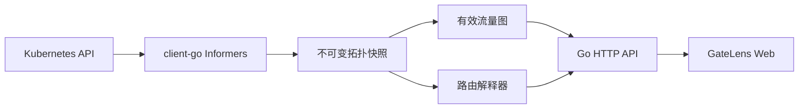

<p align="center">
  
</p>

<h1 align="center">GateLens</h1>

<p align="center"><strong>AI Gateway Explainability Platform</strong><br>让 AI 网关的配置、流量路径和故障原因变得可见。</p>

> GateLens 当前处于早期开发阶段。现有版本支持单 Kubernetes 集群、多命名空间的 Gateway API 拓扑与静态请求解释，尚不应作为生产变更或自动修复系统使用。

## 概述

AI 推理流量通常跨越 Gateway、HTTPRoute、ReferenceGrant、Service、EndpointSlice 和模型服务。单独阅读 YAML 很难判断请求会匹配哪个入口、跨命名空间后端是否被授权、以及服务是否存在可用 Endpoint。

GateLens 以只读方式监听 Kubernetes 资源，构建带来源证据的有效流量图，并通过 Web 工作台提供拓扑浏览、配置健康检查和请求模拟。

## 当前能力

- 监听单集群中的 Namespace、Service 与 EndpointSlice。
- 动态监听 Gateway API `Gateway`、`HTTPRoute` 与 `ReferenceGrant`。
- 监听 `IngressClass=higress`（含旧版 class 注解）及 Higress `McpBridge` 与 registry 配置。
- 展示 Gateway、Listener、HTTPRoute/Ingress、Service/McpBridge 与 Endpoint/Registry 的跨命名空间拓扑。
- 校验 ParentRef、BackendRef、ReferenceGrant 和 Ready Endpoint。
- 根据 HTTPRoute 或 Higress Ingress 的 Host、Path 与 Method 对请求进行静态解释。
- 提供资源搜索、配置健康清单和快照上下文。
- 使用最小只读 RBAC 部署，不修改集群资源，也不代理业务请求。

当前尚未实现：Higress/Istio 专有 CRD 的完整语义、多集群联邦拓扑、Trace/日志关联和实际流量确认。Higress Ingress 与 McpBridge 的当前支持范围见[采集设计](docs/09-higress-ingress-mcpbridge.md)，其余计划见[路线图](docs/04-roadmap.md)。

## 工作原理



请求模拟属于**按快照推断**，不等同于真实请求已经经过该路径。

## 快速开始

### 本地演示

需要 Go 1.24 或更高版本：

```bash
make run-demo
```

浏览器访问 <http://localhost:8080>。演示模式使用确定性的内置数据，不连接 Kubernetes。

不使用 Make 时：

```bash
GATELENS_MODE=demo GATELENS_ADDR=:8080 go run ./cmd/gatelens
```

### 构建与测试

```bash
make fmt
make test
make build
```

二进制输出到 `bin/gatelens`。

## 构建镜像

```bash
make image IMAGE=registry.example.com/platform/gatelens:v0.1.0
make image-push IMAGE=registry.example.com/platform/gatelens:v0.1.0
```

网络受限环境可传入 Go 模块代理：

```bash
GOPROXY=https://goproxy.cn,direct \
make image IMAGE=registry.example.com/platform/gatelens:v0.1.0
```

## 部署到 Kubernetes

前置条件：

- 集群已安装 Gateway API CRD。
- 当前版本读取 `gateway.networking.k8s.io/v1` 的 Gateway/HTTPRoute，以及 `v1beta1` 的 ReferenceGrant。
- 若要采集 Higress 配置，集群还需安装 Higress `networking.higress.io/v1` McpBridge CRD。
- 镜像已推送到集群可访问的仓库。

```bash
make deploy IMAGE=registry.example.com/platform/gatelens:v0.1.0
```

或者修改 [`deploy/kubernetes.yaml`](deploy/kubernetes.yaml) 中的镜像后执行：

```bash
kubectl apply -f deploy/kubernetes.yaml
kubectl -n gatelens-system port-forward svc/gatelens 8080:80
```

### 集群权限

GateLens 的 ServiceAccount 仅拥有以下只读权限：

| API Group | Resources | Verbs |
| --- | --- | --- |
| core | namespaces, services | get, list, watch |
| discovery.k8s.io | endpointslices | get, list, watch |
| networking.k8s.io | ingresses | get, list, watch |
| gateway.networking.k8s.io | gateways, httproutes, referencegrants | get, list, watch |
| networking.higress.io | mcpbridges | get, list, watch |

不需要 `cluster-admin`，也没有 create、update、patch 或 delete 权限。

## 配置

| 环境变量 | 默认值 | 说明 |
| --- | --- | --- |
| `GATELENS_ADDR` | `:8080` | HTTP 监听地址 |
| `GATELENS_MODE` | `kubernetes` | `kubernetes` 使用 in-cluster 配置；`demo` 使用内置数据 |
| `GATELENS_CLUSTER_ID` | `in-cluster` | 拓扑和快照中的集群标识 |

## HTTP API

| Endpoint | 说明 |
| --- | --- |
| `GET /api/v1/context` | 集群、命名空间、快照与能力 |
| `GET /api/v1/topology` | 规范化拓扑节点和边 |
| `GET /api/v1/resources?q=` | 搜索当前快照资源 |
| `GET /api/v1/health/findings` | 配置健康问题 |
| `POST /api/v1/route-explanations` | 按快照解释请求匹配和后端状态 |

## 项目结构

```text
cmd/gatelens/        进程入口
internal/api/        HTTP API 与嵌入式 Web
internal/kube/       Kubernetes informer、快照和解析
internal/domain/     通用领域模型
internal/demo/       本地演示数据源
deploy/              Kubernetes 部署清单
docs/                产品、架构和 ADR 文档
```

详细说明见[代码目录结构](docs/08-code-structure.md)。

## 开发与贡献

```bash
make test
make run-demo
```

提交变更前请保证：

- `go test ./...` 通过。
- 新增网关语义具有匿名化测试样本。
- 推断结果保留来源和快照信息。
- 不采集 Authorization、Cookie、API Key、提示词或响应正文。

架构调整请新增 ADR，不要改写已经接受的历史决策。参见 [`docs/adr`](docs/adr/README.md)。

## 文档

- [产品范围与用户旅程](docs/01-product-scope.md)
- [系统架构与数据流](docs/02-architecture.md)
- [统一领域模型与可解释路由](docs/03-domain-model.md)
- [前端展示设计](docs/05-frontend-design.md)
- [跨命名空间与跨集群设计](docs/06-federated-routing.md)
- [Higress Ingress 与 McpBridge 采集设计](docs/09-higress-ingress-mcpbridge.md)
- [架构决策记录](docs/adr/README.md)

## 安全

GateLens 当前仅提供只读能力。请不要在公开 Issue 中提交集群凭据、访问日志或业务请求内容。

## 许可证

项目尚未选择开源许可证。首次公开发布前必须添加明确的 `LICENSE` 文件；在此之前，请不要假定代码已获得任何开源许可。