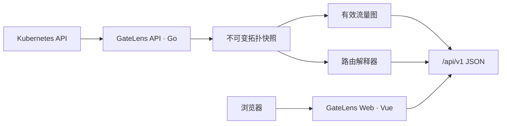

<p align="center">
  
</p>

<h1 align="center">GateLens</h1>

<p align="center"><strong>AI Gateway Explainability Platform</strong><br>让 AI 网关的配置、流量路径和故障原因变得可见。</p>

> GateLens 当前处于早期开发阶段。现有版本支持由每集群 Agent 汇总的多集群拓扑与静态配置关联，尚不应作为生产变更或自动修复系统使用。

## 概述

AI 推理流量通常跨越 Gateway、HTTPRoute、ReferenceGrant、Service、EndpointSlice 和模型服务。单独阅读 YAML 很难判断请求会匹配哪个入口、跨命名空间后端是否被授权、以及服务是否存在可用 Endpoint。

GateLens 以只读方式监听 Kubernetes 资源，构建带来源证据的有效流量图。Go API 与 Vue Web 是两个独立进程：API 负责采集、规范化和路由解释；Web 只消费 JSON 契约并展示结果。

## 当前能力

- 每个集群由只读 Agent 监听 Namespace、Service、EndpointSlice 与网关配置，中央 Server 汇总快照。
- 动态监听 Gateway API `Gateway`、`HTTPRoute` 与 `ReferenceGrant`。
- 监听 `IngressClass=higress` 及 Higress `McpBridge` 与 registry 配置。
- 展示 Gateway、Listener、HTTPRoute/Ingress、Service/McpBridge 与 Endpoint/Registry 的跨命名空间拓扑。
- 校验 ParentRef、BackendRef、ReferenceGrant 和 Ready Endpoint。
- 根据 Host、Path 与 Method 对请求进行静态解释。
- 提供资源搜索、配置健康清单和快照上下文。
- 自动定位网关的 Ready Pod；联邦模式由归属集群 Agent 主动领取查询，并通过临时 port-forward 读取 Envoy `/config_dump`。
- 聚合 Wasm、`ext_proc` 和其他 Envoy Filter 的运行时挂载点，并关联 ECDS、Wasm 模块和上游 Cluster。
- 使用最小只读 RBAC，不修改集群资源，也不代理业务请求。

当前尚未实现 Higress/Istio 专有 CRD 的完整语义、Trace/日志关联和实际流量确认。跨集群边来自出站目标与远端入口配置的唯一精确匹配；请求模拟属于**按快照推断**，不等同于真实请求已经经过该路径。

## 架构



后端不再包含、构建或托管任何 HTML、JavaScript 和 CSS。开发环境由 Vite 将 `/api` 代理到 Go 服务；生产环境由独立的 Web 容器托管静态产物，并把 `/api` 转发到 API Service。

## 快速开始

需要 Go 1.24、Node.js `^20.19.0` 或 `>=22.12.0`，以及 npm 9 或更高版本。推荐使用仓库 `.nvmrc` 指定的 Node.js 24：

```bash
cd frontend
nvm install
nvm use
```

先启动演示 API：

```bash
make run-api-demo
```

在另一个终端启动前端：

```bash
make run-web
```

浏览器访问 <http://localhost:5173>。演示 API 位于 <http://localhost:8080>，Vite 开发服务器会自动代理请求。

不使用 Make 时：

```bash
GATELENS_MODE=demo GATELENS_ADDR=:8080 go run ./cmd/gatelens
cd frontend
npm ci
npm run dev
```

## 构建与测试

```bash
make fmt
make test
make build-all
```

API 二进制输出到 `bin/gatelens-api`，前端生产资源输出到 `frontend/dist/`。也可分别执行 `make test-api`、`make test-web`、`make build-api` 和 `make build-web`。

## 构建镜像

API 与 Web 使用独立镜像：

```bash
make image \
  API_IMAGE=registry.example.com/platform/gatelens-api:v0.1.0 \
  WEB_IMAGE=registry.example.com/platform/gatelens-web:v0.1.0
make image-push \
  API_IMAGE=registry.example.com/platform/gatelens-api:v0.1.0 \
  WEB_IMAGE=registry.example.com/platform/gatelens-web:v0.1.0
```

网络受限环境可通过 `GOPROXY` 覆盖 API 镜像的 Go 模块代理。

## 部署中央 Server 和 Web 到 Docker

Docker 主机需要安装 Docker Engine；推荐使用 Docker Compose v2，脚本也兼容旧的
`docker-compose` 独立命令。仓库根目录执行：

```bash
sh deploy/docker-server.sh up
```

脚本只使用已有的 `gatelens-api` 与 `gatelens-web` 镜像，不会在部署机上
构建镜像；本地不存在时由 Compose 从配置的镜像仓库拉取。首次运行还会生成
`deploy/docker.env`，其中包含镜像地址和随机的 `GATELENS_AGENT_TOKEN`。
该文件已被 `.gitignore` 排除，不应提交到仓库。

默认访问地址为 `http://<Docker 主机>:8080`。只有 Web 的 8080 端口对外暴露；
Web 会把浏览器请求和 Agent 的 `/api/` 请求转发到 Docker 内部的中央 Server。
因此各 Kubernetes 集群 Agent 应配置：

```yaml
- name: GATELENS_SERVER_URL
  value: "http://<Docker 主机>:8080"
- name: GATELENS_AGENT_TOKEN
  valueFrom:
    secretKeyRef: {name: gatelens-agent-auth, key: token}
```

每个 Agent 集群中的 Secret token 必须与 `deploy/docker.env` 中的值一致。
跨主机或生产部署应在 Web 前增加 HTTPS 反向代理，并将
`GATELENS_SERVER_URL` 改为对应的 HTTPS 地址。

常用管理命令：

```bash
sh deploy/docker-server.sh status
sh deploy/docker-server.sh logs
sh deploy/docker-server.sh restart
sh deploy/docker-server.sh down
```

监听地址、端口、镜像名和 stale 阈值可参考
`deploy/docker.env.example`，在首次启动前写入 `deploy/docker.env`。

## 部署到 Kubernetes

前置条件：

- Gateway API CRD 是可选的；未安装时 Agent 仍会汇总核心 Kubernetes 资源，安装后可提供 Gateway API 拓扑。
- 若已安装，当前版本读取 `gateway.networking.k8s.io/v1` 的 Gateway/HTTPRoute，以及 `v1beta1` 的 ReferenceGrant。
- 若要采集 Higress 配置，集群还需安装 `networking.higress.io/v1` McpBridge CRD。
- API 与 Web 镜像已推送到集群可访问的仓库。

```bash
kubectl create namespace gatelens-system --dry-run=client -o yaml | kubectl apply -f -
kubectl -n gatelens-system create secret generic gatelens-agent-auth \
  --from-literal=token="$GATELENS_AGENT_TOKEN" --dry-run=client -o yaml | kubectl apply -f -
make deploy \
  API_IMAGE=registry.example.com/platform/gatelens-api:v0.1.0 \
  WEB_IMAGE=registry.example.com/platform/gatelens-web:v0.1.0
kubectl -n gatelens-system port-forward svc/gatelens 8080:80
```

访问 <http://localhost:8080>。`gatelens` Service 指向 Web，Web 只访问中央 `gatelens-api`。每个接入集群的 `gatelens-agent` 都以相同方式持有本集群只读权限并上报快照，中央 Server 和 Web 不持有集群读取权限。集群用途由 `GATELENS_CLUSTER_NAME` 的显示名表达，拓扑不会赋予某个集群特殊的入口角色。

其他集群使用 `deploy/agent.yaml`：修改其中的 `GATELENS_CLUSTER_ID`、`GATELENS_CLUSTER_NAME` 和 `GATELENS_SERVER_URL`，在远端创建同值的 `gatelens-agent-auth` Secret 后应用清单。无需配置 `ClusterLink`。

升级 Agent 时应重新执行 `kubectl apply -f deploy/agent.yaml`，不要只替换 Deployment 镜像；新版采集器可能增加只读 informer，对应的 ClusterRole `list/watch` 权限也必须同步更新。辅助 informer 暂时不可用时 Agent 仍会上报核心快照，但对应资源不会出现在拓扑中。

## 配置

### API

| 环境变量 | 默认值 | 说明 |
| --- | --- | --- |
| `GATELENS_ADDR` | `:8080` | API HTTP 监听地址 |
| `GATELENS_MODE` | `kubernetes` | `server` 汇总 Agent 快照；`agent` 采集本集群并上报；`kubernetes` 为单集群兼容模式；`demo` 使用内置数据 |
| `GATELENS_CLUSTER_ID` | `in-cluster` | 拓扑和快照中的集群标识 |
| `GATELENS_ALLOWED_ORIGINS` | 空 | 允许直接跨域调用 API 的 Origin，多个值用逗号分隔 |
| `GATELENS_CLUSTER_NAME` | cluster ID | Agent 上报的集群显示名 |
| `GATELENS_SERVER_URL` | 空 | Agent 上报快照的中央 Server 地址；`agent` 模式必填 |
| `GATELENS_AGENT_TOKEN` | 空 | Server 接收快照和 Agent 上传时使用的共享 Bearer token |
| `GATELENS_AGENT_INTERVAL` | `30s` | Agent 快照上报周期 |
| `GATELENS_STALE_AFTER` | `2m` | Server 将未更新 Agent 标记为 stale 的阈值 |

### Web

| 环境变量 | 使用位置 | 说明 |
| --- | --- | --- |
| `GATELENS_API_PROXY` | Vite 开发时 | `/api` 开发代理目标，默认 `http://127.0.0.1:8080` |
| `VITE_API_BASE_URL` | 前端构建时 | API 绝对地址；同源部署保持为空 |
| `GATELENS_API_UPSTREAM` | Web 容器运行时 | Nginx API 上游，默认 `http://gatelens-api:8080` |

## HTTP API

| Endpoint | 说明 |
| --- | --- |
| `GET /healthz` | API 进程健康检查 |
| `GET /api/v1/context` | 集群、命名空间、快照与能力 |
| `GET /api/v1/topology` | 规范化拓扑节点和边 |
| `GET /api/v1/envoy/config?gatewayID=` | 指定 Gateway 的 Envoy 配置 |
| `GET /api/v1/resources?q=` | 搜索当前快照资源 |
| `GET /api/v1/health/findings` | 配置健康问题 |
| `POST /api/v1/route-explanations` | 按快照解释请求匹配和后端状态 |
| `POST /api/v1/agent/snapshots` | Agent 向中央 Server 上报集群快照 |
| `GET /api/v1/agent/commands/next?clusterID=` | Agent 长轮询领取本集群运行时查询 |
| `POST /api/v1/agent/command-results` | Agent 向中央 Server 回传运行时查询结果 |

## 项目结构

```text
cmd/gatelens/        API 进程入口
internal/api/        纯 JSON HTTP API
internal/kube/       Kubernetes informer、快照和解析
internal/agent/      每集群快照上报器
internal/federation/ 中央快照汇总和自动关联
internal/domain/     通用领域模型
internal/demo/       本地演示数据源
frontend/            Vue 3 + TypeScript 独立前端
assets/              品牌资源，由前端构建使用
deploy/              API/Web Kubernetes 部署清单
docs/                产品、架构和 ADR 文档
```

详细说明见[代码目录结构](docs/08-code-structure.md)。

## 开发与贡献

提交变更前请保证：

- `go test ./...` 通过。
- `cd frontend && npm run typecheck && npm run build` 通过。
- 新增网关语义具有匿名化测试样本。
- 推断结果保留来源和快照信息。
- 不采集 Authorization、Cookie、API Key、提示词或响应正文。

架构调整请新增 ADR，不要改写已经接受的历史决策。参见 [`docs/adr`](docs/adr/README.md)。

## 文档

- [产品范围与用户旅程](docs/01-product-scope.md)
- [系统架构与数据流](docs/02-architecture.md)
- [统一领域模型与可解释路由](docs/03-domain-model.md)
- [前端展示设计](docs/05-frontend-design.md)
- [跨命名空间与跨集群设计](docs/06-federated-routing.md)
- [Higress Ingress 与 McpBridge 采集设计](docs/09-higress-ingress-mcpbridge.md)
- [架构决策记录](docs/adr/README.md)

## 安全

GateLens 当前仅提供只读能力。请不要在公开 Issue 中提交集群凭据、访问日志或业务请求内容。

## 许可证

项目尚未选择开源许可证。首次公开发布前必须添加明确的 `LICENSE` 文件；在此之前，请不要假定代码已获得任何开源许可。
