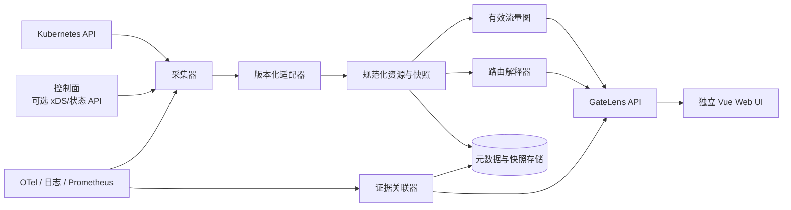

# GateLens 系统架构与数据流

## 架构概览

## 职责边界

| 层 | 职责 | 约束 |
| --- | --- | --- |
| 采集器 | Watch K8s 资源，按需读取控制面与观测数据 | 最小权限、只读、记录时间与版本 |
| 适配器 | 标准/专有资源转规范化模型 | 与目标 CRD、控制面版本绑定 |
| 有效图构建器 | 解析引用、绑定、状态和端点 | 保留对象和边的来源 |
| 路由解释器 | 输入请求计算候选、淘汰原因、决策 | 不模拟不可见运行时状态 |
| 证据关联器 | 把 Trace/日志/指标投影到逻辑路径 | 标明时间窗、来源和关联方法 |
| API/UI | 图查询、请求模拟、异常展示 | 字段脱敏并实施 RBAC |

## 数据真实性分层

| 类别 | 示例 | UI 标记 |
| --- | --- | --- |
| 声明（Declared） | HTTPRoute spec、InferencePool spec | `配置声明` |
| 解析（Resolved） | Controller status、EndpointSlice、xDS 快照 | `控制面/集群状态` |
| 观测（Observed） | access log、span、metric | `实际观测` |
| 推断（Inferred） | 解释器的路径结论 | `按快照推断` |

所有推断必须携带输入快照 ID 与规则版本，不能作为运行事实展示。

## 数据流

1. 采集器生成不可变 `TopologySnapshot`，包含 `clusterID`、`observedAt`、UID 和 resourceVersion。
2. 适配器转化节点、边、策略和状态；未知字段保留原始引用。
3. 构图计算 Gateway -> Listener -> Route -> Rule -> Backend -> Service -> Endpoint，以及策略边。
4. 用户请求固定到一个快照，解释器产生 `RouteExplanation`。
5. 证据先按 trace/request ID 关联，再按时间窗和标签弱关联；弱关联明确标为近似。

## Web 与 API 边界

Web 和 API 是独立构建、独立运行的部署单元。Go API 只提供 `/api/v1` JSON 与 `/healthz`，不包含静态页面；Vue Web 不复刻路由语义，只展示后端在固定快照上生成的拓扑和解释结果。本地由 Vite 代理 API，生产由 Web 容器的同源反向代理连接内部 API Service。

只有 API 工作负载持有 Kubernetes 只读权限，Web 工作负载无集群访问权限。该边界允许两者独立发布和扩缩容，同时保持浏览器端同源访问。
## 部署与扩展

首选单集群内只读 Server + Web UI。后续多集群使用 Agent 或受控 kubeconfig，并以 `tenantID + clusterID` 隔离。

RBAC 默认仅需所需 API 组的 `get/list/watch` 和可选观测后端查询权限，不以 cluster-admin 作为安装前提。

扩展点：`SourceAdapter`（采集）、`Normalizer`（版本化映射）、`RoutingSemantics`（过滤器/推理语义）、`EvidenceProvider`（观测）。插件需声明版本、GVK、已覆盖语义和已知空白。
