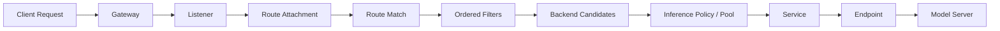

# 统一领域模型与可解释路由

## 逻辑拓扑

此图服务于请求流转解释，不是 Kubernetes 对象的一一对应树。一个节点可关联多个对象，一个对象也可产生多条带不同条件的边。

## 最小领域对象

| 对象 | 核心字段 | 用途 |
| --- | --- | --- |
| `ResourceRef` | cluster, GVK, namespace, name, uid, version | 回链原始资源 |
| `TopologyNode` | id, type, sourceRefs, state | 图节点 |
| `TopologyEdge` | from, to, relation, conditions, evidence | 图关系 |
| `PolicyAttachment` | target, scope, order, effect, sourceRef | 策略生效范围 |
| `BackendCandidate` | ref, weight, availability, eligibilityReasons | 后端候选 |
| `TopologySnapshot` | id, clusterID, observedAt, sources, graph | 可复现计算输入 |
| `RouteExplanation` | snapshotID, request, steps, outcome, confidence | 请求模拟结论 |
| `EvidenceEvent` | timestamp, type, attributes, source, correlation | 运行时事实 |

## 解释器顺序

1. 入口候选：地址、端口、协议、SNI/Host 找 Listener，并列出不匹配理由。
2. 路由绑定：按 allowedRoutes、namespace selector、parentRef 选已附着 Route。
3. 规则匹配：基于 Gateway API 计算 Host、Path、Method、Header、Query；无法确认的优先级标为未知。
4. 过滤器变换：由适配器给出可解释顺序；无法模拟的扩展过滤器形成“未知影响”步骤。
5. 后端解析：检查 ReferenceGrant、后端对象、端口、Service、EndpointSlice、Controller 状态。
6. 推理选择：解释模型路由、优先级、权重、健康/容量等可见条件；对随机或实时私有状态只输出候选集。
7. 结果：`Routed`、`Rejected`、`Unresolved`、`NoHealthyBackend` 或 `Indeterminate`。

## 置信度与隐私

| 等级 | 条件 |
| --- | --- |
| 高 | 相关资源已解析，且有匹配时间窗内 trace/log |
| 中 | 配置与 Controller 状态完整，无数据面证据 |
| 低 | 语义或资源未知，或结论仅弱关联 |
| 无法判定 | 缺少入口、适配器或关键运行时状态 |

默认仅保存路由必需元数据。Header 采用允许列表；`Authorization`、Cookie、API Key 始终掩码或不入库；请求/响应正文默认不采集。快照与证据按租户、集群分区，证据采用可配置 TTL。
