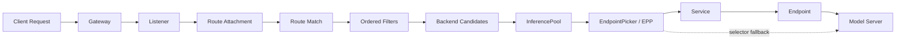

# 统一领域模型与可解释路由

## 逻辑拓扑

```mermaid
flowchart LR
  C[Client Request] --> G[Gateway] --> L[Listener] --> R[Route Attachment]
  R --> M[Route Match] --> F[Ordered Filters] --> B[Backend Candidates]
  B --> P[InferencePool] --> D[EndpointPicker / EPP]
  D --> S[Service] --> E[Endpoint] --> U[Model Server]
  D -. selector fallback .-> U
```

此图服务于请求流转解释，不是 Kubernetes 对象的一一对应树。一个节点可关联多个对象，一个对象也可产生多条带不同条件的边。

## 最小领域对象

| 对象 | 核心字段 | 用途 |
| --- | --- | --- |
| `ResourceRef` | cluster, GVK, namespace, name, uid, version | 回链原始资源 |
| `TopologyNode` | id, type, sourceRefs, state | 图节点 |
| `TopologyEdge` | from, to, relation, conditions, evidence | 图关系 |
| `PolicyAttachment` | target, scope, order, effect, sourceRef | 策略生效范围 |
| `BackendCandidate` | ref, weight, availability, eligibilityReasons | 后端候选 |
| `TopologySnapshot` | id, clusterID, observedAt, sources, graph | 可复现计算输入 |
| `ProbeExecution` | schemaVersion, id, HTTP 响应摘要, segments, issues, final 引用 | Server 对外的实时探测结果 |
| `ProbeAgentResult` | schemaVersion, probeID, traceID, clusterID, gatewayID, http?, hops, collection, issues | Agent 返回的局部事实 |
| `ProbeSegment` | gatewayID, snapshotObservedAt, hops, collection, relationState, links, localTerminalHopIDs, issues | 一个网关的唯一证据持有者 |
| `ObservedHop` | id, contextID, 日志身份/连接/路由/响应, internalRedirect, aiRouting, extProcs | 一条访问日志的实际观测 |
| `ProbeIssue` | scope, code, message, contextID?, hopID? | 所属位置的一条结构化问题 |
| `EvidenceEvent` | timestamp, type, attributes, source, correlation | 运行时事实 |

## 解释器顺序

1. 入口候选：地址、端口、协议、SNI/Host 找 Listener，并列出不匹配理由。
2. 路由绑定：按 allowedRoutes、namespace selector、parentRef 选已附着 Route。
3. 规则匹配：基于 Gateway API 计算 Host、Path、Method、Header、Query；无法确认的优先级标为未知。
4. 过滤器变换：由适配器给出可解释顺序；无法模拟的扩展过滤器形成“未知影响”步骤。
5. 后端解析：检查 ReferenceGrant、后端对象、端口、Service、EndpointSlice、Controller 状态。
6. 推理选择：解释模型路由、优先级、权重、健康/容量等可见条件；对随机或实时私有状态只输出候选集。
7. 结果：`Routed`、`Rejected`、`Unresolved`、`NoHealthyBackend` 或 `Indeterminate`。

## 置信度与隐私

| 等级 | 条件 |
| --- | --- |
| 高 | 相关资源已解析，且有匹配时间窗内 trace/log |
| 中 | 配置与 Controller 状态完整，无数据面证据 |
| 低 | 语义或资源未知，或结论仅弱关联 |
| 无法判定 | 缺少入口、适配器或关键运行时状态 |

默认仅保存路由必需元数据。Header 采用允许列表；`Authorization`、Cookie、API Key 始终掩码或不入库；请求/响应正文默认不采集。快照与证据按租户、集群分区，证据采用可配置 TTL。

## 实时探测协议（版本 2）

`ProbeExecution` 只保存请求实测结果与各网关段，不复制顶层日志、采集状态或问题。`ProbeAgentResult.http` 仅出现在真实请求命令；其他网关只读取日志，不发送第二次请求，也不参与覆盖源 HTTP 结果。Segment 的 `snapshotObservedAt` 是配置快照时间，Hop 的 `observedAt` / `requestStartTime` 是日志时间。

完整尝试分组仅用于 Server 内部分析。`contextID` 在 Segment 内隔离运行时、原始开始时间与下游连接；`links` 是已确认的 redirect 后继连接。前端只根据已有连接排列尝试，不按时间、响应码或模型变化补造关系。段级 `relationState` 为概览，可靠上下文与未知上下文共存时仍保留可靠连接。

`localTerminalHopIDs` 表示各上下文已确认的网关终止尝试；`finalResponseHopID` 还要求源网关单上下文、稳定采集、无相关问题、精确 Probe ID 关联且与实测 HTTP 码一致；`finalUpstreamHopID` 进一步要求仅一个网关段且无执行问题。普通非 redirect 记录可以作为候选，但不能等同于上述确认引用。

状态、关系、问题作用域/原因码、关联依据、推断置信度、ext_proc 结果、命令类型、快照一致性、探测 HTTP 方法及入口 Scheme 均使用具名枚举。Go 使用具名 string 类型和常量，TypeScript 从集中运行时值列表派生联合类型。JSON 保持可读字符串；原始日志的 Method、Protocol、响应详情、模型、Provider、地址及扩展原因保持开放值。

问题只在所属执行或网关段存储，按 `(scope, code, contextID, hopID)` 去重；`message` 只用于展示，不参与稳定性与关系判断。创建和查询接口都返回 `schemaVersion: 2`；未版本化旧载荷及非法枚举明确报错。前端、Server、Agent 必须同步升级或整体回滚，详见 [实际路径观测说明](10-observed-traffic-path.md)。
