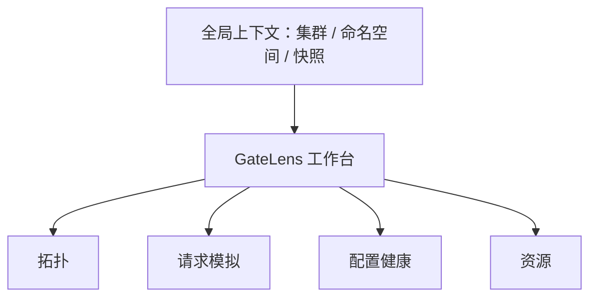

# GateLens 前端展示设计

## 设计目标

GateLens 是面向重复排障与配置核查的运维工具，前端应是紧凑、可扫描的工作台，而非营销式仪表盘。首屏直接进入正在工作的集群和网关上下文。

前端必须帮助用户回答两个 MVP 问题：

1. 当前 Gateway 的**有效配置**如何把流量连接到后端和模型服务？
2. 给定一个请求，按固定快照它**为何会命中、被拒绝或无法解析**？

“某一真实请求实际怎样流转”依赖日志、Trace 或指标证据，属于阶段 2，不在首版承诺范围内。

## MVP 信息架构



| 页面 | 用户任务 | MVP 内容 |
| --- | --- | --- |
| 拓扑 | 看清有效流量关系 | 逻辑图、筛选、选中节点详情、告警数量 |
| 请求模拟 | 解释一个请求的静态路由结果 | 请求表单、结果路径、逐步理由、源对象链接 |
| 配置健康 | 发现未生效或断开的配置 | 问题清单、严重级别、影响资源、定位链接 |
| 资源 | 查看原始资源与解析状态 | 可搜索表格、概要、状态条件、只读 YAML/JSON |

左侧为固定窄导航；顶部只保留全局上下文和刷新状态。页面内部不再嵌套卡片，主内容采用稳定的分栏工作区。

## 全局上下文与快照

每个视图顶部显示并可切换：

- `集群`：必选。MVP 单集群部署时仍保留此控件，显示当前集群但不可切换。
- `命名空间`：默认“全部”，影响资源列表、拓扑的初始过滤，不隐藏跨命名空间依赖。
- `快照`：默认最新完成快照，显示采集时间和资源版本摘要。
- `数据状态`：`正在同步`、`最新快照`、`数据过期`、`同步失败`。

模拟结果必须固定绑定快照。用户切换快照时，结果区清空并提示重新运行，防止把不同时间的配置混在一起。

## 页面一：拓扑

### 布局

```text
+----------------------+----------------------------------------------------+
| 导航                 | 集群 / 命名空间 / 快照                同步状态     |
+----------------------+----------------------------------------------------+
|                      | 筛选: 类型  状态  仅问题节点  搜索                 |
| 拓扑                 +----------------------------+-----------------------+
| 请求模拟             |                            | 选中对象详情          |
| 配置健康             |       有效流量图           | 名称 / 类型 / 状态    |
| 资源                 |  Gateway -> ... -> Endpoint| 来源资源              |
|                      |                            | 入边 / 出边 / 问题    |
|                      |                            | [查看资源] [模拟请求] |
+----------------------+----------------------------+-----------------------+
```

主图显示逻辑路径 `Gateway -> Listener -> Route -> Rule -> Backend -> Service -> Endpoint`。推理扩展对象作为策略或池节点出现，而非被伪装成标准 Gateway API 节点。

### 交互规则

- 默认以一个 Gateway 为根；未选择 Gateway 时展示网关列表，而不是一次渲染全量集群图。
- 点击节点在右侧打开详情，点击边显示关系、成立条件及来源资源。
- 搜索用于定位名称，类型/状态筛选用于缩小图；“仅问题节点”保留问题节点到最近 Gateway/后端的必要路径。
- 图按层级从左到右布局，自动适应容器但不以缩小文字替代缩放；提供缩放、适配画布、重置视图三个图标按钮及工具提示。
- 图中颜色只表达状态，形状表达节点类型，不能仅依赖颜色。建议：健康绿色、警告琥珀色、错误红色、未知灰色；正常路径使用中性蓝灰。
- 节点数量超出阈值时，按类型/命名空间聚合并显示数量，用户展开后再获取或渲染细节。

### 右侧详情面板

详情按以下顺序呈现：

1. 名称、Kind、命名空间、状态徽标和资源版本；
2. 可读摘要，例如 Route 匹配条件或 Backend 权重；
3. 关联关系和可点击对象；
4. 状态条件与健康问题；
5. 来源对象只读预览，支持复制资源引用和跳转“资源”页。

它不直接编辑 YAML，也不把长原始配置塞进图节点工具提示。

## 页面二：请求模拟

### 布局

桌面端采用左侧输入、右侧结果的稳定两栏；窄屏时纵向堆叠，结果置于表单后。

```text
+----------------------------------+---------------------------------------+
| 请求输入                         | 路由结论                              |
| Gateway / Listener               | Routed / Rejected / ...   置信度       |
| Method  Host                     | 固定快照：时间 / ID                    |
| Path    命名空间                 +---------------------------------------+
| Headers (允许列表)               | 1 Listener 候选                        |
| Model identifier (可选)          | 2 Route 绑定与规则匹配                  |
| [运行模拟] [重置]                | 3 过滤器变换                            |
|                                  | 4 后端解析与候选                        |
|                                  | 5 推理选择 / 不确定因素                 |
+----------------------------------+---------------------------------------+
```

### 输入与安全

- Gateway 为必选下拉框；Listener 可选，未选时由解释器尝试匹配并展示候选。
- Method、Host、Path 为结构化字段；Header 以可增删的键值行输入，限制在允许列表和安全长度内。
- 模型标识字段只在当前适配器声明支持时显示；否则隐藏而非展示无效控件。
- 不接收或显示 `Authorization`、Cookie、API Key。命中敏感 header 名称时在本地立即拒绝提交并给出字段级说明。
- 执行按钮在必填字段有效且系统有可用快照时启用；请求中显示固定尺寸 loading 状态，避免布局跳动。

### 结果表达

结果顶部固定显示结果类型和证据标签：`按快照推断`。下方使用可展开的编号步骤，而不是只给一张最终路径图：

- 通过步骤显示命中的对象、匹配条件和来源资源。
- 排除步骤显示候选对象及单一明确原因，例如“Host 不匹配”或“ReferenceGrant 不允许”。
- 未知影响显示适配器不支持的过滤器、缺失的实时调度状态或不完整资源。
- 后端结果展示候选集、权重、Endpoint 可用性；只有具备确定性证据时才标记最终选择。

用户可点击任一步“在拓扑中查看”，携带快照和对象定位返回拓扑页。

## 页面三：配置健康

首版不是泛化告警中心，而是静态解析问题的待办清单。默认以严重程度降序表格显示，支持状态、Kind、命名空间和 Gateway 过滤。

| 严重度 | 规则示例 | 影响说明 |
| --- | --- | --- |
| 错误 | 后端引用未解析、跨命名空间引用未授权、无可用 Endpoint | 路由可能不可用或请求失败 |
| 警告 | Route 未 Accepted、监听器协议不匹配、权重为零 | 配置可能未按预期生效 |
| 信息 | 使用未知扩展过滤器、未支持推理语义 | 解释结果存在边界 |

每行提供“查看资源”“在拓扑中定位”“用此路由模拟”操作。规则要展示检测依据和快照时间，不提供“一键修复”。

## 页面四：资源

资源页为排障的事实底座，采用可虚拟滚动的表格而不是资源卡片墙：Kind、名称、命名空间、状态、更新时间、关联问题。详情抽屉包含摘要、状态条件、引用关系、原始对象只读视图和复制资源引用动作。

原始 YAML/JSON 仅作为核验材料，默认折叠在详情末尾；支持搜索关键字段和复制，不支持在线修改。

## 状态设计

每个页面都应处理以下状态，避免空白或误导：

| 状态 | 表达与可用操作 |
| --- | --- |
| 首次加载 | 保持工具栏尺寸的骨架，不伪造拓扑节点 |
| 无资源 | 说明当前上下文未发现受支持资源，保留上下文切换 |
| 同步中 | 显示上一个完成快照及其时间，明确“非实时” |
| 数据过期 | 顶部警告，仍允许查看旧快照和模拟 |
| 权限不足 | 说明缺少的资源类型/读取范围，不泄露对象内容 |
| 适配器未知 | 展示原始资源引用和支持边界，标记无法推断 |
| 查询失败 | 保留最近成功内容，提供重试图标按钮和错误摘要 |

## 视觉与可用性规范

- 面向桌面优先，最小可用宽度 1024px；移动端支持资源查看和模拟结果阅读，不承诺完整图编辑体验。
- 采用浅色中性底色、白色工作表面、深色文本，绿色/琥珀/红色只用于状态。避免以单一冷色主导界面。
- 页面标题使用紧凑的 20-24px 字号；正文 14px；不使用随视口缩放的字体或负字距。
- 图节点、表格行、工具栏和分栏使用稳定高度与最小宽度；长资源名截断并有悬浮完整名称。
- 图例、颜色和状态名称始终同时出现；图操作只用熟悉图标并配 tooltip。
- 键盘可访问：Tab 顺序与视觉顺序一致，抽屉可关闭并返回触发点，图选中项有文本等价信息。

## 前端 API 契约（MVP）

前端不拼接 Kubernetes 对象来推导路由；所有有效图和解释结论由后端在指定快照上计算。最小 API：

| 接口 | 目的 | 关键返回 |
| --- | --- | --- |
| `GET /api/v1/context` | 集群、命名空间、可用快照、同步状态 | context options, newest snapshot |
| `GET /api/v1/topology` | 某 Gateway 的图和问题摘要 | nodes, edges, evidence refs, truncation |
| `GET /api/v1/resources` | 资源搜索和详情 | summaries, conditions, raw object ref |
| `GET /api/v1/health/findings` | 配置健康清单 | severity, rule, affected refs, snapshot |
| `POST /api/v1/route-explanations` | 对固定快照运行模拟 | outcome, steps, candidates, confidence |

所有响应包含 `snapshotID`、`observedAt`、`adapterCapabilities`。前端据此决定是否显示模型输入、推理选择等实现特有控件。

## MVP 验收场景

1. 用户选中一个 Gateway，在 30 秒内从图中看到任意 HTTPRoute 对应的 Service 和 Endpoint，以及状态问题。
2. 用户输入 Host、Path 和 Method 后，得到命中规则或未命中理由，并能跳转到每个涉及资源。
3. 后端引用无效或 Endpoint 不可用时，健康页和拓扑同时可定位，且显示相同快照时间。
4. 支持范围外的推理扩展不产生伪造路径，而显示“适配器未知”及源对象。
5. 任意模拟结果均显式标为“按快照推断”，且不展示敏感 header 值。
