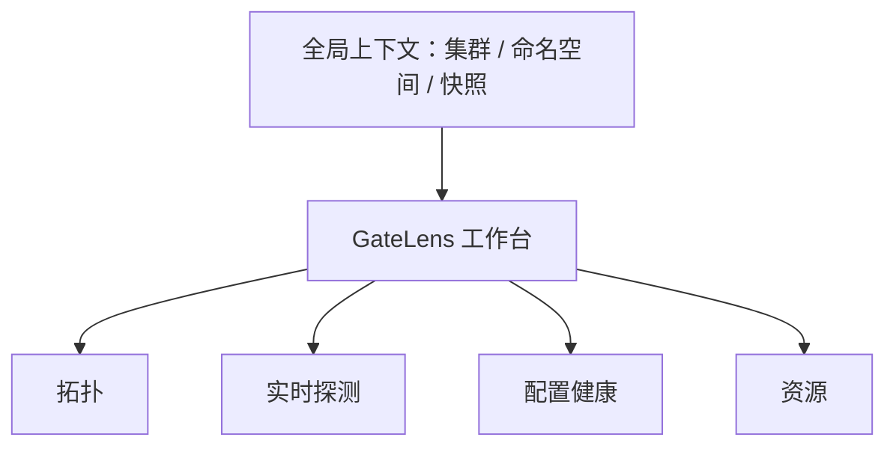

# GateLens 前端展示设计

## 设计目标

GateLens 是面向重复排障与配置核查的运维工具，前端应是紧凑、可扫描的工作台，而非营销式仪表盘。首屏直接进入正在工作的集群和网关上下文。

前端必须帮助用户回答两个问题：

1. 当前 Gateway、Route、Service 和 Endpoint 声明了哪些配置关系和健康状态？
2. 一次真实探测请求实际经过了哪些已接入 Gateway，并命中了哪个 Route 和 upstream？

配置拓扑只表达声明关系，不预测最终 Route/upstream。实际路径以访问日志等运行时证据为准。

## MVP 信息架构


```mermaid
flowchart TB
  APP[GateLens 工作台]
  APP --> TOPO[拓扑]
  APP --> PROBE[实时探测]
  APP --> HEALTH[配置健康]
  APP --> RES[资源]
  TOPBAR[全局上下文：集群 / 命名空间 / 快照] --> APP
```

| 页面 | 用户任务 | MVP 内容 |
| --- | --- | --- |
| 拓扑 | 看清有效流量关系 | 逻辑图、筛选、选中节点详情、告警数量 |
| 实时探测 | 验证真实请求的实际网关路径 | 网关入口选择、请求表单、跨网关日志证据、证据缺口 |
| 配置健康 | 发现未生效或断开的配置 | 问题清单、严重级别、影响资源、定位链接 |
| 资源 | 查看原始资源与解析状态 | 可搜索表格、概要、状态条件、只读 YAML/JSON |

左侧为固定窄导航；顶部只保留全局上下文和刷新状态。页面内部不再嵌套卡片，主内容采用稳定的分栏工作区。

## 全局上下文与快照

每个视图顶部显示并可切换：

- `集群`：必选。MVP 单集群部署时仍保留此控件，显示当前集群但不可切换。
- `命名空间`：默认“全部”，影响资源列表、拓扑的初始过滤，不隐藏跨命名空间依赖。
- `快照`：默认最新完成快照，显示采集时间和资源版本摘要。
- `数据状态`：`正在同步`、`最新快照`、`数据过期`、`同步失败`。

探测结果记录各网关段对应的快照与观测时间。用户切换集群上下文时清空当前结果，避免混淆证据来源。

## 页面一：拓扑

### 布局

```text
+----------------------+----------------------------------------------------+
| 导航                 | 集群 / 命名空间 / 快照                同步状态     |
+----------------------+----------------------------------------------------+
|                      | 筛选: 类型  状态  仅问题节点  搜索                 |
| 拓扑                 +----------------------------+-----------------------+
| 实时探测             |                            | 选中对象详情          |
| 配置健康             |       有效流量图           | 名称 / 类型 / 状态    |
| 资源                 |  Gateway -> ... -> Endpoint| 来源资源              |
|                      |                            | 入边 / 出边 / 问题    |
|                      |                            | [查看资源] [实时探测] |
+----------------------+----------------------------+-----------------------+
```

主图显示逻辑路径 `Gateway -> Listener -> Route -> Rule -> Backend -> Service -> Endpoint`。推理扩展对象作为策略或池节点出现，而非被伪装成标准 Gateway API 节点。

### 交互规则

- 默认以一个 Gateway 为根；未选择 Gateway 时展示网关列表，而不是一次渲染全量集群图。
- 点击节点在右侧打开详情，点击边显示关系、成立条件及来源资源。
- 搜索用于定位名称，类型/状态筛选用于缩小图；“仅问题节点”保留问题节点到最近 Gateway/后端的必要路径。
- 图按层级从左到右布局，自动适应容器但不以缩小文字替代缩放；提供缩放、适配画布、重置视图三个图标按钮及工具提示。
- 图中颜色只表达状态，形状表达节点类型，不能仅依赖颜色。建议：健康绿色、警告琥珀色、错误红色、未知灰色；正常路径使用中性蓝灰。
- 节点数量超出阈值时，按类型/命名空间聚合并显示数量，用户展开后再获取或渲染细节。

### 右侧详情面板

详情按以下顺序呈现：

1. 名称、Kind、命名空间、状态徽标和资源版本；
2. 可读摘要，例如 Route 匹配条件或 Backend 权重；
3. 关联关系和可点击对象；
4. 状态条件与健康问题；
5. 来源对象只读预览，支持复制资源引用和跳转“资源”页。

它不直接编辑 YAML，也不把长原始配置塞进图节点工具提示。

## 页面二：实时探测

### 布局

桌面端采用左侧输入、右侧结果的稳定两栏；窄屏时纵向堆叠，结果置于表单后。

```text
+----------------------------------+---------------------------------------+
| 探测请求                         | 运行时证据                              |
| 网关入口 Service                | HTTP 状态 / 耗时 / 完整性                |
| Method  Host                     | Probe ID / Trace ID                    |
| Path    超时                     +---------------------------------------+
| API Key (可选)                   | 1 源 Gateway 的 Route/upstream          |
| Content-Type / Body              | 2 后续 Gateway 的 Route/upstream        |
| [发送探测]                       | 3 证据缺口                              |
+----------------------------------+---------------------------------------+
```

### 输入与安全

- 网关入口为必选下拉框，选项由 Agent 从 selector 命中 Ready Gateway Pod 且协议明确为 HTTP/HTTPS 的 Service 自动发现。
- Method、Host、Path、Content-Type、Body 和超时为结构化字段；用户不直接配置任意目标 URL。
- API Key 使用密码输入框，只在本次请求中以 `Authorization: Bearer <key>` 发送。默认在请求结束后清空；用户可显式选择仅在当前标签页的 `sessionStorage` 中保留，关闭标签页或清空草稿后失效。API Key 不返回、不由 Server 持久化，也不下发给只读观测 Agent。
- Path、Host、Content-Type、Body 等请求草稿按集群保存在当前标签页的 `sessionStorage`，切换页面或刷新后可恢复，关闭标签页或点击“清空草稿”后失效。
- Body 最多 64 KiB，API Key 最多 8 KiB，超时最多 30 秒；执行按钮仅在入口和必填字段有效时启用。
- 请求中显示固定尺寸 loading 状态，避免布局跳动，并明确提示探测会产生真实流量。

### 结果表达

结果顶部显示 HTTP 状态、耗时和证据完整性。下方按网关段展示：

- `Observed`：访问日志匹配同一 GateLens probe ID 或 trace ID，显示 Route、upstream cluster、upstream host、响应码和耗时。
- `Inferred`：配置可关联到下一网关，但尚无该段运行时日志证明。
- `Missing`：目标集群未接入、日志不可读或没有匹配日志，必须明确展示原因。
- 多网关请求按段展示各自集群、Gateway、快照时间和日志来源，不把配置关联伪装成运行时事实。

## 页面三：配置健康

首版不是泛化告警中心，而是静态解析问题的待办清单。默认以严重程度降序表格显示，支持状态、Kind、命名空间和 Gateway 过滤。

| 严重度 | 规则示例 | 影响说明 |
| --- | --- | --- |
| 错误 | 后端引用未解析、跨命名空间引用未授权、无可用 Endpoint | 路由可能不可用或请求失败 |
| 警告 | Route 未 Accepted、监听器协议不匹配、权重为零 | 配置可能未按预期生效 |
| 信息 | 使用未知扩展过滤器、未支持推理语义 | 解释结果存在边界 |

每行提供“查看资源”和“在拓扑中定位”操作。规则要展示检测依据和快照时间，不提供“一键修复”。

## 页面四：资源

资源页为排障的事实底座，采用可虚拟滚动的表格而不是资源卡片墙：Kind、名称、命名空间、状态、更新时间、关联问题。详情抽屉包含摘要、状态条件、引用关系、原始对象只读视图和复制资源引用动作。

原始 YAML/JSON 仅作为核验材料，默认折叠在详情末尾；支持搜索关键字段和复制，不支持在线修改。

## Envoy 配置与扩展监控

Envoy 页面包含 Listener、扩展监控和原始 JSON 三个视图。扩展监控按运行时 Filter 配置聚合 Wasm、ext_proc 和其他 Envoy Filter，并展示：

- Filter 在 Listener 和 Filter Chain 中的顺序与挂载点；
- ECDS 配置、Wasm 模块、ext_proc gRPC Cluster 等可由 config dump 直接证明的依赖；
- 依赖是否在同一 config dump 中解析成功，以及用于关联的具体字段路径。

Wasm 运行时配置不等同于 Istio WasmPlugin 资源；它也可能由 EnvoyFilter 或其他控制面配置生成。Envoy config dump 不保留 Kubernetes 来源资源引用时，UI 必须显示“归属无法确认”，不能将运行时类型伪装成声明来源。

## 状态设计

每个页面都应处理以下状态，避免空白或误导：

| 状态 | 表达与可用操作 |
| --- | --- |
| 首次加载 | 保持工具栏尺寸的骨架，不伪造拓扑节点 |
| 无资源 | 说明当前上下文未发现受支持资源，保留上下文切换 |
| 同步中 | 显示上一个完成快照及其时间，明确“非实时” |
| 数据过期 | 顶部警告，仍允许查看旧快照；实时探测结果单独显示各段观测时间 |
| 权限不足 | 说明缺少的资源类型/读取范围，不泄露对象内容 |
| 适配器未知 | 展示原始资源引用和支持边界，标记无法推断 |
| 查询失败 | 保留最近成功内容，提供重试图标按钮和错误摘要 |

## 视觉与可用性规范

- 面向桌面优先，最小可用宽度 1024px；移动端支持资源查看和探测结果阅读，不承诺完整图编辑体验。
- 采用浅色中性底色、白色工作表面、深色文本，绿色/琥珀/红色只用于状态。避免以单一冷色主导界面。
- 页面标题使用紧凑的 20-24px 字号；正文 14px；不使用随视口缩放的字体或负字距。
- 图节点、表格行、工具栏和分栏使用稳定高度与最小宽度；长资源名截断并有悬浮完整名称。
- 图例、颜色和状态名称始终同时出现；图操作只用熟悉图标并配 tooltip。
- 键盘可访问：Tab 顺序与视觉顺序一致，抽屉可关闭并返回触发点，图选中项有文本等价信息。

## 前端 API 契约（MVP）

前端不拼接 Kubernetes 对象来推导路由；配置图由后端构建，实际路径由主动探测结果提供。最小 API：

| 接口 | 目的 | 关键返回 |
| --- | --- | --- |
| `GET /api/v1/context` | 集群、命名空间、可用快照、同步状态 | context options, newest snapshot |
| `GET /api/v1/topology` | 某 Gateway 的图和问题摘要 | nodes, edges, evidence refs, truncation |
| `GET /api/v1/resources` | 资源搜索和详情 | summaries, conditions, raw object ref |
| `GET /api/v1/health/findings` | 配置健康清单 | severity, rule, affected refs, snapshot |
| `POST /api/v1/probes` | 发起真实 HTTP 探测 | probe execution, segments, hops, gaps |
| `GET /api/v1/probes/{id}` | 查询内存中的探测结果 | probe execution |

拓扑响应包含快照信息和自动发现的 `probeEntries`。探测结果包含各网关段的证据类型、观测时间和缺口。

## MVP 验收场景

1. 用户选中一个 Gateway，在 30 秒内从图中看到任意 HTTPRoute 对应的 Service 和 Endpoint，以及状态问题。
2. 用户选择网关 Service 入口并输入 Host、Path 和 Method 后，能够发起真实请求并看到匹配的访问日志证据。
3. 后端引用无效或 Endpoint 不可用时，健康页和拓扑同时可定位，且显示相同快照时间。
4. 支持范围外的推理扩展不产生伪造路径，而显示“适配器未知”及源对象。
5. API Key 默认在探测完成后清空；只有用户显式选择时才在当前标签页会话中保留，且不出现在结果、服务端存储、日志或远端观测命令中。
