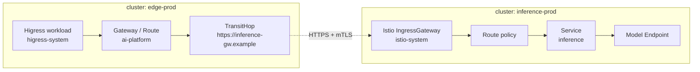

# 跨命名空间与跨集群推理流量设计

## 问题定义

AI 网关的部署命名空间、Gateway API 对象命名空间、推理服务命名空间和推理集群不应被假定为同一位置。

典型链路可以是：

```mermaid
flowchart LR
  subgraph C1[业务入口集群]
    HG[Higress 工作负载\nhigress-system] --> GW[Gateway / HTTPRoute\n配置对象命名空间]
    GW --> X[跨命名空间后端引用\n或外部上游]
  end
  subgraph C2[推理集群]
    IG[Istio IngressGateway\nistio-system] --> IGW[Istio Gateway / VirtualService\n或 Gateway API Route]
    IGW --> ISVC[推理 Service\ninference]
    ISVC --> EP[模型 Endpoint]
  end
  X -->|mTLS / HTTP(S) / 私网 LB| IG
```

这里至少有四种独立的定位维度：

| 维度 | 示例 | GateLens 的含义 |
| --- | --- | --- |
| 工作负载位置 | Higress Deployment 在 `higress-system` | 数据面实例与健康状态的归属 |
| 配置对象位置 | Gateway/HTTPRoute 在业务或平台命名空间 | 配置、授权和状态条件的归属 |
| 服务位置 | 推理 Service 在 `inference` | Kubernetes 后端引用与 Endpoint 的归属 |
| 集群位置 | Higress 与推理服务位于不同 K8s 集群 | 必须经过可观测的传输边界，不能当作集群内 Service 引用 |

工作负载部署在 `higress-system` 并不意味着所有 Gateway/Route 都属于该命名空间；GateLens 必须分别展示两者，不能以部署命名空间推断配置归属。

## 两类跨域路径

### 同集群、跨命名空间

例如 Gateway 位于 `higress-system` 或由该命名空间的控制器处理，HTTPRoute/Service 位于 `inference`。GateLens 的解释器需要独立检查：

1. Route 是否允许附着到该 Listener；
2. ParentRef 与 Listener 的命名空间、sectionName 是否匹配；
3. 后端引用是否跨命名空间；
4. 若跨命名空间，是否存在允许该引用的 `ReferenceGrant`；
5. Service 端口、EndpointSlice 与 Controller `ResolvedRefs` 状态是否可用。

图上的跨命名空间边必须标注起点和终点，例如 `ai-platform/chat-completions -> inference/qwen-service`，并将 `ReferenceGrant` 作为可点击的授权证据节点或边注释。命名空间筛选只能收起不相关对象，不能隐藏一条路径所依赖的外部命名空间。

### 跨集群、多跳

例如 Higress 把请求发往独立推理集群的 Istio IngressGateway，再由 Istio 路由到 `inference` 中的模型服务。这不是一个 Kubernetes `BackendRef` 可以完整表达的单跳关系；它至少包含：

1. 入口集群中的 Higress 路由与其上游目标；
2. 集群间传输方式，例如 DNS、私网负载均衡、网格 East-West Gateway、HTTP(S) 或 mTLS；
3. 推理集群的入口 Gateway/Listener；
4. Istio 的路由对象或 Gateway API Route；
5. 推理 Service 与模型 Endpoint。

因此 GateLens 将跨集群连接建模为显式的 `TransitHop`，而不是伪造一个指向远端 Endpoint 的普通 Service 边。

## 新增领域模型

| 对象 | 核心字段 | 作用 |
| --- | --- | --- |
| `ClusterIdentity` | id, displayName, environment, connectionState | 稳定标识一个集群 |
| `NamespaceScope` | clusterID, namespace | 避免只用 namespace 字符串识别对象 |
| Gateway 运行时元数据 | gatewayID, workloadRef, controller, readyReplicas | 合并到对应 Gateway；没有 Gateway API 对象时由 Deployment/Pod 生成规范化 Gateway 节点 |
| `TransitHop` | id, from, target, transport, destination, evidence, state | 表示集群内外的显式转发边界 |
| `ClusterLink` | fromCluster, toCluster, discoveryMode, trustState | 声明两个集群的已知连接关系 |
| `FederatedSnapshot` | id, snapshotsByCluster, capturedAt, consistency | 保存一个跨集群查询所使用的快照集合 |

`TransitHop.target` 可以是以下之一：Kubernetes Service、外部 DNS/FQDN、IP/LB 地址、网格网关、手工登记的远端入口。`transport` 记录 HTTP、HTTPS、gRPC、TCP、mTLS 或未知；未从配置或观测中得到的字段必须是 `unknown`。

## 有效流量图的表示

图保留分区而非把所有节点混排：一个分区对应一个 `clusterID`，分区内再按 Namespace 分组。跨命名空间边使用细实线和明确的 `namespace/name` 标签；跨集群边使用带方向的虚线，边中间显示传输方式和目标地址/入口名。



当远端集群没有接入时，`TransitHop` 仍然存在，但右侧显示“远端未接入”。图只展示已知的 FQDN/LB/目标引用和入口集群的证据，不能推断远端 Istio 路由或模型 Endpoint。

## 请求模拟的跨集群规则

一次模拟固定为 `FederatedSnapshot`，而不是单一 `TopologySnapshot`。结果步骤按 hop 分段：

1. `入口集群：Higress/Gateway 规则`；
2. `传输边界：目标、协议、TLS、解析证据`；
3. `推理集群：Istio 入口与路由规则`；
4. `推理服务：Service、Endpoint 和模型候选`。

每段独立标注 `Declared`、`Resolved`、`Observed` 或 `Inferred`。只有关联 Trace、请求 ID 或可靠的网关日志能跨越传输边界时，才能把两个分段称为同一条实际请求。静态推断只能表达“入口配置指向远端入口，且远端配置将匹配为某条路由”。

跨集群快照不是严格全局原子快照。UI 必须显示每个集群的采集时间、版本及一致性：`一致窗口内`、`时间差较大`、`远端不可用`。时间差过大时，将跨集群结论降为低置信度。

## 前端调整

在既有拓扑工作区增加以下元素：

- 顶部上下文由单一 `集群` 升级为“入口集群 + 已接入相关集群”；用户始终从入口集群发起浏览。
- 图按集群分区。跨集群边始终展示传输类型、目标和验证状态，不使用普通后端边的视觉样式。
- 节点详情同时显示 `配置对象位置` 与 `运行工作负载位置`；二者不同时不视为异常。
- 侧栏增加“路径范围”：`当前集群`、`已接入关联集群`。MVP 可只读显示，后续开放选择。
- 请求模拟结果以“第 1 跳 / 第 2 跳”分组。没有远端数据时，第 2 跳展示未接入状态和需要的接入条件，而不是空白。
- 健康检查新增：跨命名空间授权缺失、跨集群目标无法解析、远端入口不可观测、快照时间偏差过大。

## 分阶段交付

| 阶段 | 范围 | 结果 |
| --- | --- | --- |
| MVP | 单集群拓扑；识别并校验跨命名空间引用；将 FQDN/LB/未知上游显示为外部 `TransitHop` | 不会把跨命名空间或远端目标误画成同命名空间 Endpoint |
| P1 | 两个只读集群接入；手工或声明式注册 `ClusterLink`；拼接 Higress 到 Istio 入口的多跳图 | 可静态解释已接入两端的配置路径 |
| P2 | OTel/日志关联、服务发现与网格证据 | 可判断实际请求是否穿越两个网关并定位失败 hop |

## 需要在阶段 0 验证的真实样本

- Higress 工作负载位于 `higress-system`，但 Gateway/Route/Service 分属不同 Namespace 的样本。
- 跨命名空间 BackendRef 有效与缺少 `ReferenceGrant` 的各一份。
- Higress 通过 FQDN 或负载均衡地址访问独立推理集群 Istio IngressGateway 的样本。
- 推理集群中 Istio 配置为 Gateway API 或 Istio API 的各一份；适配器需要声明其实际支持的对象和版本。
- 一条带 trace/request ID 的成功请求与一条失败请求，用来确定跨网关关联字段。
