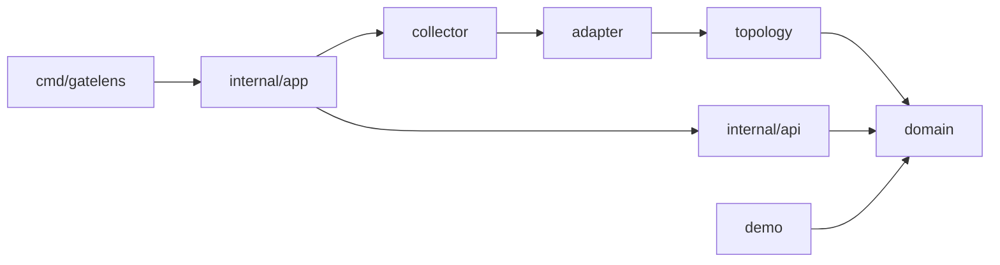

# GateLens 代码目录结构

## 当前第一版

第一版是一个 Go 单体服务，使用 Go 标准库提供 JSON API 和嵌入式静态前端。启动命令为：

```powershell
go run ./cmd/gatelens
```

默认监听 `:8080`；可通过 `GATELENS_ADDR=127.0.0.1:8088` 改写。模拟数据仅用于演示，真实 Kubernetes 接入尚未实现。

```text
.
├── cmd/
│   └── gatelens/              # 进程入口：读取配置、启动 HTTP 服务、处理退出信号
├── internal/
│   ├── api/                   # HTTP 路由、请求校验、JSON 响应、嵌入式前端资源
│   │   ├── handler.go
│   │   ├── handler_test.go
│   │   └── web/               # 当前由 Go binary embed 的静态前端副本
│   ├── app/                   # 应用装配：将数据源、领域服务和 API 连接起来
│   ├── domain/                # 无基础设施依赖的领域类型与跨集群/快照语义
│   ├── demo/                  # 当前演示数据源和确定性的路由解释器
│   ├── collector/             # 预留：Kubernetes watch、OTel、日志、Prometheus 采集器
│   ├── adapter/               # 预留：Gateway API、Higress、Istio、推理扩展版本适配器
│   └── topology/              # 预留：有效图构建、ReferenceGrant 与 TransitHop 解析
├── web/
│   └── static/                # 方便独立预览和编辑的前端源副本
├── docs/                      # 产品、架构、前端和 ADR 文档
├── go.mod
└── README.md
```

`web/static` 和 `internal/api/web` 当前是相同内容：前者方便浏览器直接预览，后者由 `go:embed` 打进二进制。前端构建工具确定后，应改成由构建产物单向复制到 `internal/api/web`，避免长期双份维护。

## 分层规则



- `domain` 不导入 HTTP、Kubernetes client 或具体网关 SDK。
- `adapter` 负责厂商/版本差异，不能让 Higress/Istio 字段泄漏到通用 API。
- `topology` 生成规范化节点、边、`TransitHop` 和快照；不负责展示布局。
- `api` 只做传输层工作，不在浏览器或 handler 中重新计算 Gateway 路由语义。
- `demo` 仅可在开发演示环境作为数据源；生产实现替换为 `collector + adapter + topology`。

## 当前 API

| 端点 | 状态 | 用途 |
| --- | --- | --- |
| `GET /api/v1/context` | 已实现 | 入口集群、命名空间、快照、适配器能力 |
| `GET /api/v1/topology` | 已实现 | 规范化节点、边、跨集群 `TransitHop` |
| `GET /api/v1/resources?q=` | 已实现 | 资源列表模拟数据 |
| `GET /api/v1/health/findings` | 已实现 | 静态配置问题模拟数据 |
| `POST /api/v1/route-explanations` | 已实现 | 基于模拟快照的路由解释 |
| Kubernetes Watch / 状态采集 | 未实现 | 下一步接入项 |
| 联邦集群连接和远端 Istio 适配器 | 未实现 | P1 接入项 |

## 从演示到真实数据的顺序

1. 在 `collector/kubernetes` 实现只读 `get/list/watch`，产出原始对象和资源版本。
2. 在 `adapter/gatewayapi` 实现 Gateway、HTTPRoute、ReferenceGrant、Service、EndpointSlice 到领域对象的映射。
3. 在 `topology` 构建不可变 `TopologySnapshot`，替换 `demo.Store`。
4. 实现 Higress 和 Istio 适配器，新增 `TransitHop` 与 `ClusterLink` 的真实证据。
5. 前端改为调用既有 API；当前页面中的硬编码演示数据随后移除。
