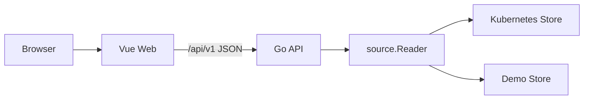
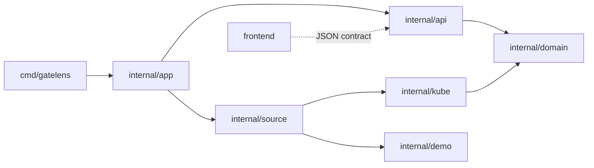

# GateLens 代码目录结构

## 当前架构

GateLens 采用前后端分离架构：Go 进程只提供 JSON API，Vue 单页应用独立开发、构建和部署。两者共享 `/api/v1` 契约，不共享源代码或构建产物。

```text
.
├── cmd/
│   └── gatelens/              # API 进程入口
├── internal/
│   ├── api/                   # HTTP 路由、校验、CORS、JSON 响应
│   ├── app/                   # 数据源与 API 装配
│   ├── domain/                # 无基础设施依赖的领域类型
│   ├── source/                # API 使用的数据源接口
│   ├── demo/                  # 确定性演示数据源
│   ├── kube/                  # Kubernetes informer、快照与解析
│   └── envoy/                 # Envoy config_dump 解析
├── frontend/
│   ├── src/api/               # 类型化 API 客户端
│   ├── src/components/        # 工作台框架和通用组件
│   ├── src/views/             # 拓扑、Envoy、模拟、健康、资源视图
│   ├── nginx/                 # 生产静态服务和 API 反向代理配置
│   ├── package.json
│   └── vite.config.ts
├── assets/                    # Logo 等品牌资源
├── deploy/                    # API 与 Web Kubernetes 工作负载
├── docs/                      # 产品、架构、前端和 ADR 文档
├── Dockerfile                 # API 镜像
└── Makefile
```

## 运行边界



- API 不导入、嵌入或托管前端资源，未知路径返回 JSON 404。
- 前端不拼接 Kubernetes 对象推导路由；拓扑和解释结论来自 API。
- 本地开发由 Vite 代理 `/api` 到 `:8080`，避免开发期跨域配置。
- 生产 Web 容器通过 Nginx 代理 `/api` 到独立 API Service。
- 必须跨 Origin 直连 API 时，用 `GATELENS_ALLOWED_ORIGINS` 配置精确白名单。

## 分层规则



- `domain` 不导入 HTTP、Kubernetes client 或具体网关 SDK。
- `kube` 负责采集、适配、快照和路由语义，不负责展示布局。
- `api` 只做传输层工作，不重新计算 Gateway 路由语义。
- `frontend` 通过 TypeScript 类型描述 API 契约，不依赖 Go 包或生成的静态副本。
- `demo` 仅用于本地演示；生产使用 Kubernetes 数据源。

## 开发命令

```bash
make run-api-demo  # :8080
make run-web       # :5173
make test
make build-all
```

也可在 `frontend/` 中单独执行 `npm ci`、`npm run typecheck`、`npm run build`。

## 部署单元

| 单元 | 镜像 | 权限 | 职责 |
| --- | --- | --- | --- |
| `gatelens-api` | `gatelens-api` | Kubernetes 只读 RBAC，按需 `pods/portforward` | 采集、快照、Envoy 读取和 JSON API |
| `gatelens-web` | `gatelens-web` | 无 Kubernetes API 权限 | 托管 Vue 构建产物、同源代理 `/api` |

外部入口仍使用 `gatelens` Service，内部 API 使用 `gatelens-api` Service，因此前后端可以独立升级和扩缩容。
