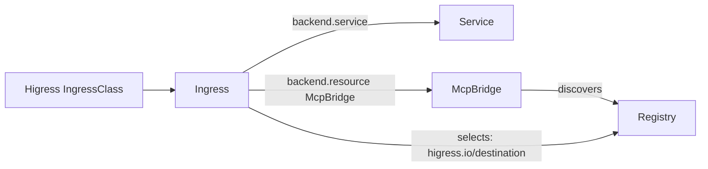

# Higress Ingress 与 McpBridge 采集设计

## 目标

GateLens 在单 Kubernetes 集群、多 Namespace 的范围内，展示 Higress 的传统 Ingress 配置和 MCP 上游配置。Higress 的数据面通常部署在 `higress-system`，而 Ingress、McpBridge 与推理服务可以位于其他 Namespace，因此采集不以工作负载所在 Namespace 作为边界。

## 采集范围

| Kubernetes 资源 | 选择规则 | 拓扑节点 |
| --- | --- | --- |
| `networking.k8s.io/v1 Ingress` | `spec.ingressClassName: higress`，或旧注解 `kubernetes.io/ingress.class: higress` | `Ingress` |
| `networking.higress.io/v1 McpBridge` | 集群内所有对象 | `McpBridge` 与每个 `spec.registries` 的 `Registry` |

需要的只读权限为 `ingresses` 与 `mcpbridges` 的 `get/list/watch`。如果集群没有安装 Higress CRD，McpBridge informer 无法启动；部署前应先安装 Higress，或在后续版本中改为可选发现。

## 规范化关系

`Ingress.backend.resource` 只有在 `apiGroup=networking.higress.io`、`kind=McpBridge` 时才被解析为 MCP 后端。普通 `backend.service` 保持同 Namespace 的 Kubernetes Ingress 语义。`higress.io/destination` 使用 `registryName.registryType`（例如 `github.dns`）匹配 `spec.registries`，作为明确选择某注册中心的配置证据。

## 健康发现和请求解释

- 引用不存在的 McpBridge 或 Service 产生错误发现。
- McpBridge 没有 `spec.registries` 产生警告发现。
- destination 未匹配到本 McpBridge 的 registry 产生警告发现，不推断未知目标。
- Ingress Service 后端没有 Ready Endpoint 会作为错误后端参与请求解释。
- 已匹配的 Higress Ingress 路径写入统一 route rule，因此现有的 Host、Path、Method 静态解释接口能返回 Ingress 和其后端。

## 非目标

本版本不采集 MCP 调用日志、工具列表或认证凭据，也不将远程 FQDN 自动展开成另一个 Kubernetes 集群内的路径。跨集群的 Higress 到 Istio/推理集群关系仍按 [跨集群设计](06-federated-routing.md) 作为后续阶段处理。
