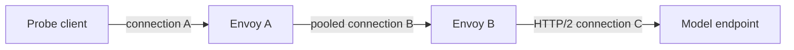
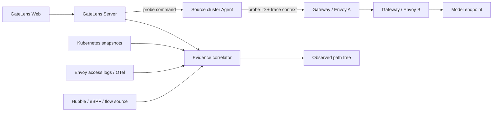

# 主动探测与实际流量路径观测设计

> 实现状态（2026-09-17）：阶段 A 已实现，使用 Higress JSON 访问日志，不依赖 eBPF。当前覆盖源 Agent 发起一次 HTTP 请求、多个已接入 Gateway 的只读日志采集、网关内内部重定向观察、固定 AI 路由摘要、一个或多个 ext_proc Filter State 和证据缺口；基于 Span 父子关系的分布式 Trace、Envoy 聚合指标连接器和 Hubble/eBPF 仍为后续工作。

## 0. 首版使用说明

### 0.1 Higress 日志输出位置

Higress 当前官方 Helm `helm/core/templates/configmap.yaml` 的分支是：

```yaml
accessLogEncoding: TEXT
{{- if .Values.global.o11y.enabled }}
accessLogFile: "/var/log/proxy/access.log"
{{- else }}
accessLogFile: "/dev/stdout"
{{- end }}
```

可用日志来源如下：

| Higress 输出 | GateLens 读取方式 | 条件 |
| --- | --- | --- |
| `/dev/stdout` | Kubernetes `pods/log` | 默认且推荐；Agent 需要 `pods/log get` |
| `/dev/stderr` | Kubernetes `pods/log` | Envoy 配置为 stderr 时同样适用；Higress Helm 当前默认不用此分支 |
| `/var/log/proxy/access.log` | Agent 本地文件增量读取 | 必须将同一日志文件通过共享 PVC、hostPath 或 sidecar 挂载到 Agent |
| 其他普通文件 | Agent 本地文件增量读取 | 同上；Agent 不会进入 Gateway 容器读取 |

普通文件不是节点全局可见路径。仅在 Agent 设置 `GATELENS_PROBE_LOG_FILE` 而没有对应挂载时，探测会明确返回“读取访问日志文件失败”。

### 0.2 日志格式要求

GateLens 不使用 Envoy 的 `x-request-id` 关联探测。Higress/Envoy 可以生成、保留或重写该字段，均不影响 GateLens。

每个参与探测链路的 Gateway 都必须使用单行 JSON access log，并把专用请求头输出为 JSON 字段 `gatelens_probe_id`。在现有 `accessLogFormat` JSON 对象中追加：

```text
"gatelens_probe_id":"%REQ(X-GATELENS-PROBE-ID)%"
```

例如，原格式以 `"ai_log":"%FILTER_STATE(wasm.ai_log:PLAIN)%"}` 结尾时，应改为：

```text
"ai_log":"%FILTER_STATE(wasm.ai_log:PLAIN)%","gatelens_probe_id":"%REQ(X-GATELENS-PROBE-ID)%"}
```

这是对**现有 JSON 格式的字段追加**，不要用上述片段替换完整 `accessLogFormat`。修改 Higress 配置后应确认数据面已更新，并从实际日志验证字段存在。GateLens 所需关键字段至少为：

```text
gatelens_probe_id, trace_id, start_time, method, authority, path,
route_name, upstream_cluster, upstream_host,
response_code, response_flags, response_code_details, duration
```

字段与来源的固定映射如下：

| JSON 字段 | Envoy 格式值 | 用途 |
| --- | --- | --- |
| `gatelens_probe_id` | `%REQ(X-GATELENS-PROBE-ID)%` | 主关联键，必须显式添加 |
| `trace_id` | 保留当前 Higress 格式中的 trace ID 输出 | 兜底关联键 |
| `request_id` | 可保留现状，GateLens 不读取 | Envoy/Higress 自身诊断 |

Agent 只注入 `X-GateLens-Probe-ID` 和 B3 trace header，不注入 `X-Request-ID`。跨多个网关时，必须确保路由、WasmPlugin、鉴权插件和 Header 改写规则不会删除或覆盖 `x-gatelens-probe-id`；每一跳都要输出同名 JSON 字段。

`ai_log=%FILTER_STATE(wasm.ai_log:PLAIN)%` 是可选证据。GateLens 仅从 JSON 对象提取 `provider`、`request_model`、`upstream_model`、`response_model` 四个字符串字段作为路由摘要；格式错误不影响访问日志观察。原始 `aiLog` 字段继续保留为证据，但页面不默认展示完整日志中的问题和回答，也不根据 usage 的 `outcome` 或 `downstream_disconnected` 推断请求结果。默认格式没有 ext_proc Filter State，因此 BBR/EPP 的调用阶段、gRPC 状态和内部选择理由不会自动出现。ext_proc 的具体追加方式见 [0.6](#06-bbrepp-与-ext_proc-边界)。

### 0.3 部署 Agent

中央 Server 必须显式开启探测 API。启用前应先在 Web/API 前配置身份认证、HTTPS 和操作审计：

```yaml
- name: GATELENS_ENABLE_ACTIVE_PROBES
  value: "true"
```

不再配置目标主机白名单。Agent 从 Kubernetes 快照中自动发现 selector 命中 Ready Gateway Pod 的 Service，并且只接受端口名或 `appProtocol` 明确声明 HTTP/HTTPS 的入口。Server 仍需通过上述开关显式开启真实探测。

stdout/stderr 模式不需要卷，只需确认 ClusterRole 含有：

```yaml
- apiGroups: [""]
  resources: ["pods/log"]
  verbs: ["get"]
```

若 `global.o11y.enabled=true`，Higress 写 `/var/log/proxy/access.log`，需要把日志卷以只读方式挂到 Agent，并设置 Agent 可见路径：

```yaml
env:
  - name: GATELENS_PROBE_LOG_FILE
    value: /var/log/higress/access.log
volumeMounts:
  - name: higress-access-log
    mountPath: /var/log/higress
    readOnly: true
```

具体 volume 类型必须与 Higress 的日志持久化方式一致。不同 Pod 的 `emptyDir` 不能直接共享；这种情况下应保持 `/dev/stdout`，或将日志交给集中日志系统后实现新的 Connector。

### 0.4 发起探测

Web 中打开“实时探测”，选择自动发现的网关 Service 入口，填写 Path、可选 HTTP `Host` 和 API Key：

```text
入口: higress-system/higress-gateway:80 (HTTP)
Path: /v1/chat/completions
Host: api.example.com
```

也可以调用 API：

```bash
curl -X POST http://gatelens.example.com/api/v1/probes \
  -H 'Content-Type: application/json' \
  -d '{
    "sourceCluster":"edge-prod",
    "gatewayID":"edge-prod::gateway/higress-system/higress",
	"entryID":"edge-prod::gateway/higress-system/higress/probe-entry/higress-system/higress-gateway/80",
    "method":"POST",
    "path":"/v1/chat/completions",
    "host":"api.example.com",
	"apiKey":"sk-...",
    "contentType":"application/json",
    "body":"{\"model\":\"qwen\"}",
    "timeoutSeconds":15
  }'
```

请求 Body 最多 64 KiB，API Key 最多 8 KiB。Path、Host、Content-Type 和 Body 等草稿按集群保存在当前标签页的 `sessionStorage`，刷新或切换页面后可恢复，关闭标签页或点击“清空草稿”后失效。API Key 默认不进入草稿并在探测后清空；只有用户显式选择“本次标签页保留”时才存入该标签页的 `sessionStorage`。

提交后，API Key 只在 Server 到源 Agent 的短期命令中存在；Agent 将其注入为 `Authorization: Bearer <key>`。API Key 不返回、不写入探测结果，也不发送给远端只读观测 Agent。Server 不保存请求正文或响应正文，当前只在内存中保存探测结果，重启后丢失。

### 0.5 首版工作原理

1. Server 校验源集群、Gateway、入口 ID、HTTP Method、Path、Body 大小和超时。
2. Server 生成随机 128 位 probe ID 和 128 位 B3 trace ID；不生成或设置 `x-request-id`。
3. Agent 经既有长轮询领取只包含 `entryID + path` 的 `probe-http` 命令，并再次用本地 Kubernetes 快照校验入口属于所选 Gateway；URL 由 Agent 自行构造。
4. 文件日志模式先记录文件偏移；随后 Agent 发出请求，注入 `X-GateLens-Probe-ID` 和 `X-B3-TraceId`。
5. 请求完成后，Agent 读取所有 Ready Gateway Pod 的短时间日志，或读取文件偏移后的新增内容。
6. 解析器优先接受有效 `gatelens_probe_id` 与本次 probe ID 精确相等的 JSON 行；空值、纯空白和 `-` 都视为未提供标识，此时才允许有效且匹配的 `trace_id` 兜底（忽略十六进制大小写）。有效但不匹配的 `gatelens_probe_id` 会直接拒绝，不能被 trace ID 覆盖。`request_id` 不参与关联。命中后将 `route_name`、`upstream_cluster`、`upstream_host`、响应状态和 AI 路由摘要标为 `Observed`；Path 的查询参数在保存前移除。
7. 源请求完成后，Server 向所有已接入集群中关联了 Ready 数据面 Pod 的 Gateway 下发只读 `probe-observe` 命令，不依赖静态路由或跨集群边决定观测目标。同集群的第二个 Gateway 也会被检查；纯配置对象不会产生无效查询。
8. 实际匹配 probe ID/trace ID 的 Gateway 显示为 `Observed` 后续网关段，网关段沿用时间排序；网关内尝试使用同一日志源的记录顺序，不能用相同 `start_time` 去重或建立跨 Pod 因果关系。
9. 对没有匹配日志的 Gateway，Server 通过可扩展的关联规则使用已观测 hop 的 `upstream_host` 和 `upstream_cluster` 反查网关入口：地址精确命中为高置信候选；Service DNS、Gateway `status.addresses` 或所属 Listener hostname 精确命中为中置信候选。Higress McpBridge 是首个配置链规则：它把 `.dns` 解释为 `<registry.name>.<registry.type>` 目标标识，而不是 Service 域名后缀；例如 `outbound|80||llm-inference-providers.internal.dns` 会先命中对应 Registry，再沿 `Registry -> Service` 配置关系映射到选择该 Service 的同集群 Gateway。后续其他资源关联只需增加规则；证据强度、去重和歧义处理由统一聚合器完成。若同一值匹配多个网关则标记为歧义候选。若只有跨集群配置边，则仅在该边的上一网关已经被观测时显示低置信配置候选，不越过缺失段继续推断。
10. 候选网关明确显示为“候选下一跳”和证据 gap，不计作已观测路径。没有地址、Cluster 或直接配置关系的无关广播网关继续隐藏；日志读取错误也只在网关已被判定为候选时返回，避免全局广播产生无关告警。

首版不读取 eBPF Flow，因此无法证明 TCP 建连、NAT、NetworkPolicy verdict，也不能用网络证据验证 Envoy 报告的 upstream。`upstream_host` 只证明上一跳 Envoy 选择或尝试连接了该地址，不证明候选网关已经处理请求。多网关只有在各网关原样传播 `x-gatelens-probe-id`（或至少传播 B3 trace ID）、输出对应关联字段且相应 Agent 能读取日志时，才能形成完整的已观测多跳请求路径。GateLens 会广播只读日志观测，但无法识别未接入集群；Header 被删除、请求未到达、日志延迟、日志格式缺少字段和读取权限不足都可能表现为同一个证据 gap，产品不得把 gap 单独解释成某一种原因。

### 0.6 BBR、EPP 与 ext_proc 边界

可直接执行的 Istio/Higress 日志配置、BBR EnvoyFilter 修改和验证步骤见
[Istio/Higress ext_proc 访问日志接入手册](11-istio-ext-proc-access-log.md)。本节保留设计依据和证据边界。

默认 Higress 日志可以显示 Wasm 已写入的 `ai_log` 和最终路由结果，但没有以下 ext_proc 运行时字段：

```text
request_header_call_count
request_body_call_count
request_header_latency_us
request_body_latency_us
ext_proc gRPC status
processor decision metadata
```

因此默认日志只能看到“BBR/EPP 执行后的最终 Route/Endpoint”，或者看到其主动写入 `ai_log` 的摘要，不能证明具体调用了哪个外部处理器。GateLens 第一版支持读取 Envoy 内置 ext_proc Filter State，不需要修改 BBR/EPP 自身日志，也不依赖 eBPF。

#### 0.6.1 确认 ext_proc Filter State 行为

GateLens 当前适配的 Envoy 实现会自动在“HTTP filter 配置名称”对应的 Filter State namespace 中创建 ext_proc logging info，不需要 `emit_filter_state_stats`。例如配置名为 `envoy.filters.http.ext_proc` 时，日志读取同名 namespace。应以实际数据面使用的 `ext_proc.proto` 和 `config_dump` 为准；不支持该字段的版本加入 `emit_filter_state_stats` 会导致配置校验失败。

#### 0.6.2 在 Higress JSON accessLogFormat 中追加字段

单个 ext_proc 时，最简单的配置是在现有 JSON 对象末尾追加 `TYPED` Filter State。下面仅是要追加的字段，不是完整的 `accessLogFormat`：

```text
"ext_proc":"%FILTER_STATE(envoy.filters.http.ext_proc:TYPED)%",
"gatelens_probe_id":"%REQ(X-GATELENS-PROBE-ID)%"
```

GateLens 同时兼容 `TYPED` 被日志系统编码为 JSON 对象或 JSON 字符串的情况。若当前版本不支持 `TYPED`，可以只追加该 Envoy 实现实际提供的字段：

```text
"ext_proc_request_header_latency_us":"%FILTER_STATE(envoy.filters.http.ext_proc:FIELD:request_header_latency_us)%",
"ext_proc_request_header_call_status":"%FILTER_STATE(envoy.filters.http.ext_proc:FIELD:request_header_call_status)%",
"ext_proc_request_body_call_count":"%FILTER_STATE(envoy.filters.http.ext_proc:FIELD:request_body_call_count)%",
"ext_proc_request_body_total_latency_us":"%FILTER_STATE(envoy.filters.http.ext_proc:FIELD:request_body_total_latency_us)%",
"ext_proc_request_body_last_call_status":"%FILTER_STATE(envoy.filters.http.ext_proc:FIELD:request_body_last_call_status)%",
"ext_proc_failed_open":"%FILTER_STATE(envoy.filters.http.ext_proc:FIELD:failed_open)%",
"gatelens_probe_id":"%REQ(X-GATELENS-PROBE-ID)%"
```

字段值可以是 JSON 字符串或数字。GateLens 会解析调用次数、阶段延迟、gRPC status、`failed_open` 和 immediate response；gRPC status `4` 标记为超时，`failed_open=true` 标记为失败放行。仅凭最终 HTTP 200 不会反推 BBR/EPP 成功。

#### 0.6.3 同一网关有 BBR 和 EPP 两个 ext_proc

Envoy 使用 HTTP filter 的配置名称作为 Filter State key。两个过滤器都命名为 `envoy.filters.http.ext_proc` 时会共用一个 `ExtProcLoggingInfo`：header 统计只保留第一次记录，body 统计会混合累计，不能可靠拆分 BBR 和 EPP。`stat_prefix` 只区分 Envoy 聚合指标，不会改变 Filter State key。

推荐保留控制器生成的 EPP 名称，并只把 EnvoyFilter 注入的 BBR 改成唯一配置名称。Envoy 根据 `typed_config.@type` 选择 ext_proc factory，因此该名称可以是实例标识：

```yaml
- name: gatelens.filters.http.ext_proc.bbr
  typed_config:
    "@type": type.googleapis.com/envoy.extensions.filters.http.ext_proc.v3.ExternalProcessor
    stat_prefix: bbr
    grpc_service:
      envoy_grpc:
        cluster_name: outbound|9004||body-based-router.inference.svc.cluster.local
    # 保留原 BBR processing_mode 等配置
```

EPP 继续使用 `envoy.filters.http.ext_proc`，避免破坏 InferencePool 控制器生成的 `typed_per_filter_config`。如果控制器允许设置 `stat_prefix: epp`，可用于区分 `/stats` 聚合指标，但不是请求级身份。访问日志分别读取两个实际名称：

```text
"ext_proc_bbr":"%FILTER_STATE(gatelens.filters.http.ext_proc.bbr:TYPED)%",
"ext_proc_epp":"%FILTER_STATE(envoy.filters.http.ext_proc:TYPED)%",
"gatelens_probe_id":"%REQ(X-GATELENS-PROBE-ID)%"
```

一个集群可以有多个 EPP，但一次请求最终只关联其 Route 命中的 InferencePool。GateLens 使用已观测 `route_name`，结合 `InferencePool.spec.endpointPickerRef`、对应 Service/Endpoint 和路由级 `ExtProcPerRoute.grpc_service` 确定本次 EPP；无法唯一匹配时标记歧义，不把其他 EPP 画进实际路径。GateLens 的 Envoy 配置页已按 Route 展示该 per-route ext_proc gRPC cluster。全局 `cluster_name: dummy` 且 processing mode 全部 `SKIP` 只是占位配置，本身不能证明调用了哪个 EPP；必须继续检查该 Route 的 `typed_per_filter_config` 和 `dummy` Cluster 实际配置。

处理器愿意提供扩展 metadata 时，GateLens 只读取以下白名单字段：`processor`、`rule_id`、`selected_pool`、`selected_endpoint` 和 `reason_code`，不会保存任意 metadata、请求正文或响应正文。

#### 0.6.4 推理服务证据

推理服务无需修改日志。GateLens 使用同一条网关日志中的 `upstream_cluster`、`upstream_host`、`response_code`、`response_flags`、`response_code_details`、`upstream_service_time` 和 `upstream_transport_failure_reason` 展示选择结果与故障。这里的 `upstream_host` 证明 Envoy 选择或尝试了该地址；有上游响应码时才能证明上游返回了 HTTP 响应，不能据此断言模型业务语义成功。

页面还会把处理器身份、selected pool 和 upstream 地址与同集群 Kubernetes 快照中的 BBR、EndpointPicker、InferencePool、Service 或 Endpoint 精确匹配，并显示该对象的快照健康状态。这是配置/Ready 辅助证据，不是本次请求证据；名称或地址不能唯一匹配时不显示，避免误关联。

### 0.7 网关内内部重定向观察

同一次请求可以在网关内部切换 Route、Provider 或模型。系统同时接受响应详情恰为 `internal_redirect`，或以 `internal_redirect:` 开头且后缀非空的标记，包括 `internal_redirect:ai_usage_via_upstream`、`internal_redirect:other_filter_detail`。普通 `via_upstream`、`ai_usage_via_upstream`、`internal_redirect_failed` 均不作为标记。不能仅凭 HTTP 400、模型切换或同 ID 多条日志推断 redirect；独立 `ai_usage_record` 不计访问尝试。

标准 Envoy 的标记与自定义 filter 的详情存在差异，GateLens 不依赖固定 AI filter 后缀。接入时至少输出 `response_code_details`，建议同时保留 `start_time`、`downstream_remote_address` 与 `downstream_local_address`。历史日志如果 probe ID 与 trace ID 都为 `-`，即使 request ID 相同，也不会作为一次 GateLens 探测的证据。

关联记录在所属网关段内按运行时、原始开始时间与下游连接分组，内部关系只使用同一来源的顺序。同 ID 在多个网关或 Pod 出现不直接形成内部 redirect 链；Provider、Route、模型和 cluster 变化不拆断已确认的同运行时尝试。时间相同不去重，缺失时间的展示回填不参与因果判断。

采集累计缓存保留真实 occurrence，并为本次探测生成稳定记录 ID；重读同一快照不会增加数量，来源内两条内容相同的真实记录仍各自保留。文件轮转、截断或无法定位快照重叠会保留已有证据并报告来源连续性缺口。共享文件本身不能证明发出日志的 Pod/容器，文件模式保留记录，运行时关系和最终归属保持未确认。

源请求结束后的采集窗口默认最多 2 秒，远端只读观察最多 4 秒，读取间隔 200 毫秒，稳定等待 500 毫秒。每次读取使用窗口剩余时间；命令 deadline 更早时提前停止。第一条 redirect 不会结束采集，唯一且无冲突的终止候选需要额外读取并稳定后才可结束。整个过程只多读日志，源 Agent 仍只发送一次 HTTP 请求，客户端不跟随外部 HTTP 3xx。

每个网关 Segment 的 `collection.state` 枚举为 `settled`、`window-ended`、`cancelled`、`read-error`、`unknown`。取消、读取失败或窗口结束都返回该段累计记录及结构化 `issues`；`settled` 仅表示窗口内稳定，不保证未输出的内部尝试不存在。仅有 redirect 时增加 `redirect-next-missing` 问题。有效版本 2 结果缺少身份元数据时保留证据并标记未知；旧协议直接拒绝，不进入未知证据展示路径。

Server 只返回网关段内的记录和确认引用。前端从 `segments[].hops` 的 `internalRedirect` 统计 redirect、从 `segments[].links` 统计已确认后继数，结合采集状态、段级关系和结构化问题生成过程提示。顶层 `hops`、`collection`、`logSource`、`EvidenceComplete`、`redirectSummary` 与各层 `gaps` 均已移除，不再维护重复摘要。

Agent 实际响应码或错误不被日志覆盖。`localTerminalHopIDs` 是稳定且无相关问题的各上下文网关终止引用；`finalResponseHopID` 还要求源网关只有一个上下文、精确 probe 关联、无相关问题且状态码与实测 HTTP 一致；全请求只有一个网关段且无执行问题时才设置 `finalUpstreamHopID`。多网关缺少 Span 因果关系，最终上游保持未确认。

页面区分 Agent 实测请求总耗时、日志 duration 和 upstream_service_time。共享开始时间的 440/8736 ms 不相加、不做差值推算。固定 AI 摘要提供可用 Provider 和模型；地址 `-` 显示未记录，配置映射不替代实际连接证据。联合样例与验收记录见 [内部重定向验收](12-probe-redirect-acceptance.md)。

### 0.8 版本 2 的结果结构与部署

Agent 的局部返回值为 `ProbeAgentResult`：版本、probe/trace、集群/本地网关、执行时间、可选 `http`、`hops`、`collection`、`issues`。真实请求必须有 `http`；只读命令禁止有 `http`。Server 校验版本、身份、载荷形状和固定枚举，源协议错误使探测失败，远端协议错误形成该段 `probe-protocol-unsupported` 采集问题并保留源 HTTP 响应。

Server 对外示例（空证据候选；数组始终为数组）：

```json
{
  "schemaVersion": 2,
  "id": "example-probe",
  "traceID": "example-trace",
  "sourceCluster": "edge",
  "gatewayID": "edge::gateway/demo",
  "method": "POST",
  "target": "http://gateway.demo.svc.cluster.local:80/v1/chat/completions",
  "state": "completed",
  "startedAt": "2026-10-09T00:00:00Z",
  "completedAt": "2026-10-09T00:00:02Z",
  "responseCode": 200,
  "issues": [],
  "segments": [{
    "index": 1,
    "clusterID": "edge",
    "gatewayID": "edge::gateway/demo",
    "snapshotObservedAt": "2026-10-08T23:59:50Z",
    "hops": [],
    "collection": { "state": "window-ended" },
    "relationState": "unconfirmed",
    "links": [],
    "localTerminalHopIDs": [],
    "issues": [{ "scope": "collection", "code": "no-matching-log", "message": "未找到本次请求的访问日志" }]
  }]
}
```

有日志时，每条 Hop 带唯一 `id` 和段内 `contextID`；同上下文确认连接形如 `{ "from": "gateway/record-1", "to": "gateway/record-2" }`。完整 Group 不再作为公开协议。问题存储在唯一所属位置：顶层仅 execution，段内为 collection / relation / inference。带上下文的问题可以定位到未知或歧义上下文，不影响其他上下文已有的确认连接。

`collection.state`、`relationState`、执行状态、问题作用域和原因码、关联依据、推断置信度、ext_proc 结果、快照一致性及 HTTP Method / Scheme 均为具名枚举。详细取值见 `internal/domain/probe_protocol.go` 和 `frontend/src/types.ts`；非法值不会静默转成成功或 unknown。问题说明更换语言不影响业务判断。

API 路径保持 `POST /api/v1/probes` 和 `GET /api/v1/probes/{id}`，响应与 Agent 载荷为破坏性变更。发布前停止新探测、等待在途请求完成，然后同步升级前端、Server 及全部 Agent。回滚必须三端整体回滚并重启，重新发起探测；不转换 Server 内存中的旧结果，不保留跨版本命令，不增加双协议适配。

## 1. 背景

GateLens 仍展示 Kubernetes 和 Envoy 配置拓扑，用于核验声明关系和资源健康状态，但不再根据配置快照预测一条请求的最终 Route 或 upstream。

WasmPlugin 可以根据 Header、Body、动态元数据、外部服务响应、缓存或运行时状态修改 Path、Host 等路由输入，并清除 Envoy route cache 触发重新匹配。对于第三方推理平台，GateLens 不掌握插件代码、Host ABI、外部依赖和运行时状态，因此不能可靠预测最终路由。

产品能力边界如下：

| 能力 | 回答的问题 | 证据 |
| --- | --- | --- |
| 配置拓扑核验 | 配置声明了哪些 Gateway、Route、Service 和 Endpoint 关系？ | 配置快照，不输出请求路径结论 |
| 实际流量观测 | 一条受控请求实际上经过了哪里？ | 日志、Trace、网络流，`Observed` |

实际流量观测不尝试理解任意 WasmPlugin 的业务逻辑，而是记录其执行后的真实结果。

## 2. 目标与非目标

### 2.1 目标

- 从指定位置发送一条受控的真实 HTTP/gRPC 请求。
- 展示请求实际经过的 Gateway、代理、Route、upstream cluster、Service 和 Endpoint。
- 支持跨命名空间和跨集群的多跳路径。
- 识别重试、镜像、hedging 和并行推理形成的分支路径。
- 以证据等级和时间标记区分已观测、配置解析、静态推断和未知部分。
- 尽量不修改业务应用或第三方 WasmPlugin。
- 遥测过载时允许丢失观测事件，不能阻塞业务流量。

### 2.2 非目标

- 不承诺在零接入条件下解释 WasmPlugin 内部执行了哪条代码分支。
- 不通过反编译或沙箱执行第三方 Wasm 来预测行为。
- 不把时间相近的网络连接自动声明为同一请求。
- 不采集 Cookie、提示词、请求正文或响应正文；API Key 仅用于本次请求的 Authorization Header，禁止写入日志和结果。
- 不保证观察到云负载均衡器、托管网关或未接入集群的内部实现。

## 3. 基本判断

### 3.1 eBPF 观测的是连接，不天然等于请求

eBPF 可以从节点内核获得真实的 L3/L4 网络事实，例如源/目标 Pod、IP、端口、TCP 状态、转发或丢弃结果。但 Envoy 会终止下游连接并通过连接池建立或复用上游连接：



连接 A、B、C 的五元组不同，上游连接可能早已建立，一个 HTTP/2 连接也可能同时承载多个请求。因此，仅靠 eBPF 不能可靠证明这些连接属于同一个 HTTP 请求。

### 3.2 请求级关联必须依赖 L7 标识

要精确跟踪某个请求，各代理至少需要传播一个稳定的关联标识：

- `x-gatelens-probe-id`，GateLens 主动探测的主关联键，必须防止伪造和越权查询；
- W3C `traceparent` 或 B3 trace ID，作为追踪系统和日志关联的兜底标识。

`x-request-id` 由 Envoy/Higress 管理，GateLens 不注入、不读取，也不依赖其跨网关稳定性。

Envoy 或现有遥测系统需要输出与该标识关联的 Route、upstream cluster 和 upstream host。eBPF 作为网络路径验证证据，而不是唯一的请求追踪器。

## 4. 总体架构



### 4.1 组件职责

| 组件 | 职责 |
| --- | --- |
| GateLens Server | 校验探测请求、创建任务、下发命令、收集证据、关联路径、持久化结果 |
| 集群 Agent | 在指定网络位置发请求；读取本集群允许访问的运行时证据；不上传敏感凭据 |
| Probe Runner | 限制协议、目标、超时、请求大小和并发；记录发送与响应摘要 |
| Envoy/OTel Connector | 接收或查询请求级 Route、Cluster、Upstream Host 和响应信息 |
| Flow Connector | 接入 Hubble、现有 eBPF 平台、云 Flow Logs 等连接级事实 |
| Evidence Correlator | 按 GateLens probe ID/trace ID 关联 L7 事件，使用网络流和 Kubernetes 对象进行验证与映射 |

## 5. 证据模型

沿用 GateLens 的证据分类，并增加路径事件的来源和完整性：

| 等级 | 含义 | 示例 |
| --- | --- | --- |
| `Declared` | 配置中声明 | HTTPRoute 指向 Service |
| `Resolved` | 引用已解析 | Service 对应 EndpointSlice |
| `Observed` | 运行时证据明确证明 | Envoy 日志记录 route、cluster 和 upstream host |
| `Inferred` | 根据配置或弱关联推断 | 未输出 route name，只能从 config dump 推断候选 Route |
| `Unknown` | 无足够证据 | TLS 内部字段不可见、远端集群未接入 |

每条路径边至少保存：

```text
probeID / traceID
source and destination object references
clusterID / node / namespace / workload
observedAt and monotonic or source timestamp when available
protocol / address / port
routeName / upstreamCluster / upstreamHost when available
responseCode / responseFlags / duration
evidenceType / evidenceSource / confidence
```

没有明确标识的网络流只能作为某条已知 L7 跳的验证证据。仅凭时间窗口和五元组关联时必须标记为 `Inferred`，不能升级为 `Observed`。

## 6. 主动探测流程

1. 用户选择入口、源集群、探测位置、Method、Host、Path 和可选的安全请求模板。
2. Server 执行 RBAC、快照入口归属和风险校验，生成 `probeID` 和 trace context。
3. Server 通过现有 Agent 长轮询通道下发 `probe-http` 命令。
4. Agent 在集群内部发出请求。凭据只通过集群内 Secret 引用读取，不回传明文。
5. 各 Envoy 和遥测组件记录该请求的 L7 决策；Flow Source 同时记录相关连接。
6. Server 在有限时间窗口内等待证据，按 probe ID、Trace 父子关系和 trace ID 组装路径。
7. Correlator 将 upstream IP 映射到 Service、EndpointSlice、Pod、Node 和集群快照。
8. 结果以路径树展示。重试、镜像和并发上游分别形成分支。
9. 超时后返回已有证据，并明确列出未观测边界，不补画虚构路径。

### 6.1 探测位置

探测结果依赖请求从哪里发出，至少支持：

- GateLens 所在集群的 Agent；
- 指定源集群 Agent；
- 指定 Namespace 中受控的临时 Probe Pod；
- 外部探测器，作为后续可选能力。

UI 必须显示探测位置，不能把集群内请求等同于公网用户请求。

## 7. Envoy 与 Wasm 的观测边界

推荐 Envoy 结构化访问日志或 OTel Span 至少包含：

```text
timestamp
GateLens probe ID / trace ID
proxy, cluster and workload identity
request method, authority, original path and final path when available
route name
upstream cluster
upstream host
response code and response flags
duration
selected dynamic metadata/filter state allowlist
```

这些字段可以证明 Wasm 执行后的最终路由结果，但通常不能证明具体由哪个 WasmPlugin、哪条代码分支进行了修改。

若平台希望展示：

```text
原始 Path -> 某过滤器修改 Path -> 清除 route cache -> 二次路由
```

至少需要满足一种扩展观测契约：

- WasmPlugin 将允许公开的变换摘要写入 dynamic metadata 或 filter state；
- 在过滤器链关键位置安装统一观测 Filter；
- 平台现有 Trace/日志包含过滤器级事件；
- GateLens 为特定平台提供专用 Connector。

否则只展示“入口字段”和“最终路由”，中间变换标记为 `Unknown`。

## 8. eBPF、Cilium 与 Hubble

### 8.1 eBPF DaemonSet 的作用

独立 eBPF Sensor 通常以 DaemonSet 在每个节点运行，加载经过内核验证的 eBPF 程序，在 socket、cgroup、TC 或 tracepoint 等位置记录网络事件。它提供：

- Pod/进程到目标 IP:Port 的实际连接；
- TCP 建连、关闭、重传或失败等信号；
- 节点、方向、字节量和转发/丢弃结果；
- 在数据源支持时提供 NAT 前后、策略 verdict 和服务身份。

它不应承担任意 TLS 解密、全量 Payload 抓取或 Wasm 语义解释。

### 8.2 Cilium/Hubble 接入

Cilium 是 Kubernetes CNI 和 eBPF 数据面。Hubble Server 使用 Cilium 已产生的流事件，Hubble Relay 聚合所有节点。因此：

- 集群已使用 Cilium 时，GateLens 应只读接入 Hubble Relay，不重复部署 eBPF Sensor；
- 只安装 Hubble Relay 不能为非 Cilium 集群产生流数据；
- 不应为了 GateLens 观测而要求用户更换现有 CNI；
- 非 Cilium 集群通过统一 `FlowSource` 接口接入现有网络观测系统或后续的独立 Sensor。

建议接口：

```text
FlowSource
|- CiliumHubbleSource
|- ExistingEBPFSource
|- CloudFlowLogSource
|- CNIFlowSource
`- GateLensEBPFSensor (later)
```

## 9. 性能设计

eBPF 程序会在内核网络路径上同步执行，因此不是零成本。大流量平台必须遵循以下原则：

- 默认只采集聚合后的 L3/L4 Flow 或连接事件，不做全量逐包追踪。
- 在内核或数据源侧按集群、Namespace、Workload、端口和时间窗口尽早过滤。
- 主动探测时短时间提高目标路径的采集粒度，结束后恢复默认模式。
- 缓冲区、队列和存储均有界；过载时丢遥测并报告 `lostEvents`，不反压业务流量。
- 对高基数 Header、URL 和标签实行 allowlist、脱敏和长度限制。
- 如果已有 Hubble 或企业级流平台，复用现有数据源，避免重复内核探针。
- 上线前测量开启前后的吞吐、CPU、p95/p99 延迟、Agent CPU、事件丢失率和存储增长。

GateLens 不规定一个通用的“可接受开销”数字。不同内核、CNI、流量模式和采集粒度差异很大，必须在目标环境灰度验证。

## 10. 安全与副作用控制

主动探测会产生真实流量，必须视为高风险能力：

- 禁止任意 URL，只允许从当前快照选择已发现的 Gateway Service HTTP/HTTPS 入口；Agent 独立复核且不跟随重定向。
- 使用独立 RBAC 权限，例如 `probe:execute`、`probe:read` 和 `probe:admin`。
- 限制 Method、请求大小、响应读取大小、超时、并发和每用户速率。
- 默认不允许具有明显副作用的请求；推理平台优先使用测试租户、测试模型或约定的 dry-run 能力。
- Secret 只在 Agent 所在集群读取和使用，Server、日志和 UI 不保存明文。
- 不记录 Authorization、Cookie、API Key、提示词和响应正文。API Key 只存在于源 Agent 的内存请求上下文中。
- `x-gatelens-probe-id` 必须由 Server 签发并限制有效期，不能允许用户查询其他租户的同名 ID。
- 对所有探测操作记录审计日志，包括操作者、目标、时间、模板和结果摘要。

## 11. API 与领域模型草案

现有 Agent 命令只支持 `envoy-config`。后续可增加：

```text
AgentCommand.kind = probe-http
```

建议新增 API：

| API | 用途 |
| --- | --- |
| `POST /api/v1/probes` | 创建主动探测任务 |
| `GET /api/v1/probes/{id}` | 获取状态和证据完整度 |
| `GET /api/v1/probes/{id}/path` | 获取规范化路径树 |
| `POST /api/v1/telemetry/envoy-events` | 接收结构化 Envoy/OTel 事件，具体部署可替换为消息系统 |

建议领域对象：

| 类型 | 关键字段 |
| --- | --- |
| `ProbeRequest` | sourceCluster, gatewayID, entryID, method, host, path, apiKey, contentType, body, timeout |
| `ProbeExecution` | schemaVersion=2, id, traceID, HTTP 结果, segments, issues, final 引用 |
| `ProbeAgentResult` | schemaVersion=2, probeID, traceID, clusterID, gatewayID, http?, hops, collection, issues |
| `ProbeSegment` | gatewayID, snapshotObservedAt, hops, collection, relationState, links, localTerminalHopIDs, issues |
| `TrafficEvidence` | type, source, timestamp, clusterID, attributes, redactionState |
| `ObservedHop` | from, to, route, upstream, evidenceRefs, confidence |
| `ObservedPath` | probeID, snapshotRefs, branches, gaps, completeness |

## 12. 前端表达

前端只提供 `实时探测` 请求入口：发送真实请求，显示风险提示、探测位置和实际证据。配置页面仍展示静态资源关系，但不提供“配置预检”或预测路径结论。

路径视图按事件顺序或路径树展示：

```text
Probe source
  -> Gateway A
     route=chat, observed
  -> Gateway B
     route=qwen, observed
  -> Service inference/qwen
  -> Pod qwen-7c9d
```

每一跳必须显示：

- 集群、Namespace、工作负载和时间；
- `Observed`、`Resolved`、`Inferred` 或 `Unknown` 标签；
- Envoy、Trace、eBPF 或 Kubernetes 等证据来源；
- 未观测边界、事件丢失和快照时间偏差；
- 重试、镜像或并发上游产生的独立分支。

## 13. 分阶段落地

### 阶段 A：Envoy 请求级证据

- 增加 `probe-http` Agent 命令和受控请求执行器。
- 定义 Envoy access log/OTel 最小字段契约。
- 按 GateLens probe ID/trace ID 组装 Route、Cluster 和 Upstream Host。
- 将 IP 映射到现有 Kubernetes 拓扑。
- 先覆盖单集群和双网关的成功/失败样本。

### 阶段 B：连接级验证

- 定义 `FlowSource` 接口和规范化 Flow 事件。
- 首先实现 Hubble Connector，不自研 CNI。
- 用网络流验证 Envoy 报告的代理和 Endpoint 连接。
- 展示 NetworkPolicy 丢弃、连接失败和未观测边界。

### 阶段 C：多集群与分支路径

- 跨集群关联同一 Trace，处理时钟偏差和重复事件。
- 展示重试、镜像、hedging、并发推理和部分失败。
- 增加数据保留、租户隔离和规模化存储。

### 阶段 D：可选的过滤器级解释

- 定义 dynamic metadata/filter state allowlist 契约。
- 为愿意接入的平台提供统一观测 Filter 或专用 Connector。
- 仍不把缺少证据的 Wasm 内部行为标记为已观测。

## 14. 验收标准

首个可用版本至少满足：

1. 用户可从指定 Agent 发出一条受控请求，并获得唯一 probe ID 和 trace ID。
2. 单个 Envoy 能展示实际 Route、upstream cluster、upstream host、响应码和耗时。
3. 双网关场景能用同一 Trace 关联两段请求，缺失一段时明确显示 gap。
4. upstream IP 能映射到正确的 Service、EndpointSlice 和 Pod。
5. Hubble 可用时展示连接验证；不可用时不影响 L7 探测结果。
6. 任意 Wasm 存在时不进行代码级推断，只展示观测到的输入和最终结果。
7. 遥测事件丢失、快照不一致和时间偏差会降低完整度，不生成虚构路径。
8. 探测凭据、请求正文和响应正文不进入 Server 持久化或日志。

## 15. 待验证问题

- 目标 Higress、Istio 和 Envoy 版本实际可输出哪些日志格式字段。
- 多个网关是否原样传播 `x-gatelens-probe-id` 和 trace context，Wasm 是否会修改或删除它们。
- 推理平台是否存在测试模型、dry-run 或无副作用探测约定。
- 各目标集群当前使用的 CNI 和已有 Flow/Trace 平台。
- Envoy access log、ALS、OTel Collector 和消息系统中哪一种接入方式运维成本最低。
- HTTP/2、gRPC streaming、连接复用和长响应下，探测完成条件如何定义。
- 跨集群时钟偏差、Trace 采样策略和日志保留时间是否满足关联要求。
